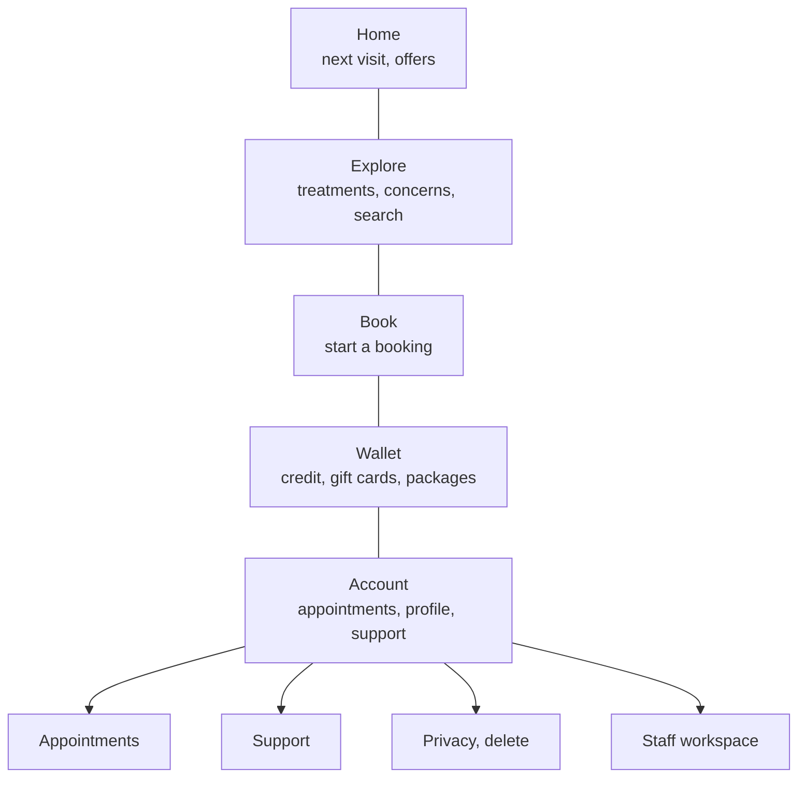
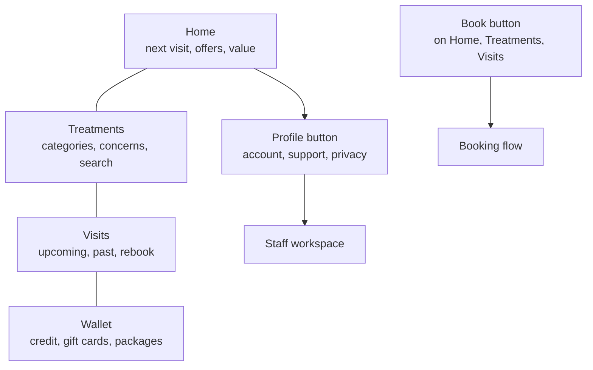
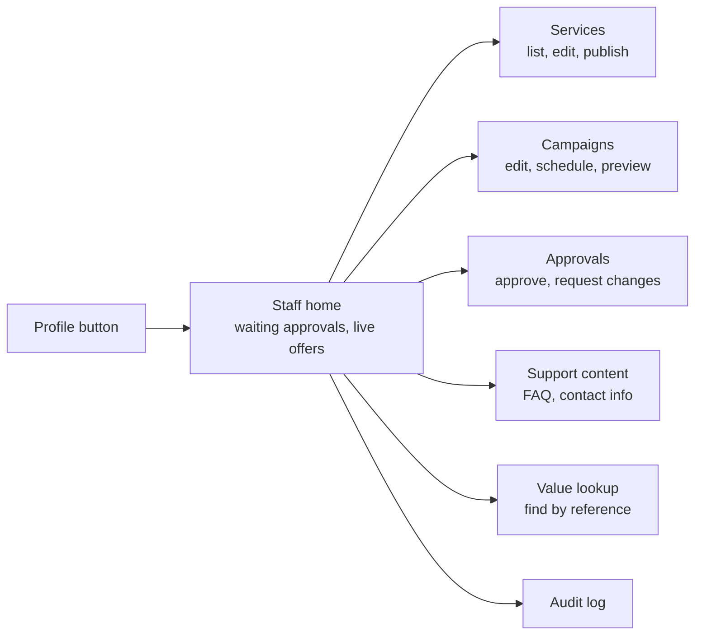

# Nano Beauty App — Phase 2 Navigation (IA)

Sep 25, 2026 · @Dragon

## Customer tasks

The most frequent returning-customer tasks are checking the next visit and managing it; guests mostly browse and book. Navigation must make those one tap away. Frequency is an estimate for a small clinic and is confirmed in testing.

| # | Task | Who | How often | Urgency | Requirement IDs |
| --- | --- | --- | --- | --- | --- |
| T1 | Find a treatment for a concern | Guest, new | Every first visit | Low | DISC 02–06 |
| T2 | Book an appointment | All customers | Every 4–8 weeks | Medium | BOOK 01–07 |
| T3 | Check next appointment (time, place, prep) | Returning | Several times before each visit | High on the day | DISC 01, BOOK 08, NOTIF 03 |
| T4 | Reschedule or cancel | Returning | Occasionally | High | BOOK 09–10 |
| T5 | See past visits and rebook | Returning | After each visit | Low | BOOK 08, BOOK 12 |
| T6 | Check package sessions or gift-card balance | Package/gift holders | Before booking | Medium | WALT 04–08, WALT 10 |
| T7 | Buy a gift card or package | All | A few times a year | Low | WALT 01–02, WALT 05 |
| T8 | Open an offer and use it | All | Twice a month (campaign cadence) | Medium | PROMO 03–06 |
| T9 | Get help about a visit or payment | Returning | Rare | High when needed | SUP 01–04 |
| T10 | Manage profile, notifications, privacy, delete account | Returning | Rare | Low | AUTH 04–06, NOTIF 04, PRIV 01–08 |
| T11 | Staff: edit services, publish campaigns, approve changes | Staff | Weekly | Medium | ADMIN 01–10 |

## Option A — five tabs

Option A keeps the requirements' suggestion: Home, Explore, Book, Wallet, Account. It is familiar and gives Wallet its own tab, but appointments sit inside Account and Book is an action dressed as a place.

The five tabs sit side by side; Account holds four sub-areas, including appointments.

- **Promotes:** booking (always one tap), stored value (own tab), discovery.
- **Hides:** upcoming and past appointments (two taps deep inside Account), support.
- **Risk:** the Book tab opens the same service picker as Explore, so two tabs lead to the same place; on iOS, tabs are meant for places, not actions.

## Option B — four places + a Book button

Option B has four tabs — Home, Treatments, Visits, Wallet — and makes Book a persistent primary button instead of a tab. Account moves to a profile button at the top of Home.

Four tabs are places; the Book button and profile button start actions from where the customer already is.

- **Promotes:** appointments (own tab, one tap), booking from context (a treatment or past visit pre-fills the flow), fewer tabs with clearer labels.
- **Hides:** account and support behind the profile button (support is also linked from every appointment and payment).
- **Risk:** customers must spot the Book button; it is the one violet button on each screen and is tested in Phase 4.

## Evaluation

Option B scores 30 of 35 against Option A's 26 and needs 21 taps across the 11 tasks versus 23; the gain is all in appointment tasks, the most frequent for returning clients.

**Taps from app launch to the task screen** (fewer is better; contextual shortcuts like the Home appointment card are equal in both)

| Task | Option A path | A | Option B path | B |
| --- | --- | --- | --- | --- |
| T1 Find by concern | Explore → concern | 2 | Treatments → concern | 2 |
| T2 Book | Book tab | 1 | Book button | 1 |
| T3 Next visit detail | Home card | 1 | Home card | 1 |
| T4 Manage another visit | Account → Appointments → visit → Manage | 4 | Visits → visit → Manage | 3 |
| T5 Past visit, rebook | Account → Appointments → Past → Rebook | 4 | Visits → Past → Rebook | 3 |
| T6 Check balance | Wallet | 1 | Wallet | 1 |
| T7 Buy gift card | Wallet → Buy | 2 | Wallet → Buy | 2 |
| T8 Open offer | Home → offer | 1 | Home → offer | 1 |
| T9 Get help | Account → Support | 2 | Profile → Support | 2 |
| T10 Delete account | Account → Privacy → Delete | 3 | Profile → Privacy → Delete | 3 |
| T11 Staff workspace | Account → Staff | 2 | Profile → Staff | 2 |
| **Total** |  | **23** |  | **21** |

**Criteria scores** (1 = poor, 5 = strong)

| Criterion | A | B | Why |
| --- | --- | --- | --- |
| Frequent tasks are shallow (T3–T5) | 3 | 5 | B gives visits their own tab |
| Labels are distinct | 3 | 4 | A's Explore and Book lead to the same picker |
| Useful for guests | 5 | 4 | A shows Book in the bar; B relies on the button |
| Stored value is visible | 5 | 5 | Both give Wallet a tab |
| Tabs are places, not actions (iOS/Android guidance) | 3 | 5 | A's Book tab is an action |
| Room for later features without a new tab | 3 | 4 | B keeps a fifth slot free |
| Account and support are easy to find | 4 | 3 | B moves them behind the profile button |
| **Total (of 35)** | **26** | **30** |  |

## Recommendation and route map

Recommend **Option B**: Home, Treatments, Visits, Wallet, plus a Book button and a profile button. It keeps appointments one tap away and follows platform guidance; the Book button's visibility is the one thing Phase 4 must prove. If guests miss it in testing, the fallback is Option A.

**Guest rule:** guests see all four tabs. Visits and Wallet show a short explanation and a Sign in button instead of empty lists (AUTH 01).

| Route (Expo Router) | Screen | Access | Requirement IDs |
| --- | --- | --- | --- |
| `/(tabs)/index` | Home | Everyone | DISC 01, DISC 11 |
| `/(tabs)/treatments` · `/treatments/[slug]` · `/treatments/concern/[id]` · `/treatments/search` | Treatments, detail, concern, search | Everyone | DISC 02–10 |
| `/(tabs)/visits` · `/visits/[id]` · `/visits/[id]/reschedule` · `/visits/[id]/cancel` | Upcoming/past, detail, manage | Signed in | BOOK 08–12 |
| `/(tabs)/wallet` · `/wallet/credit` · `/wallet/packages/[id]` · `/wallet/gift-cards/[id]` · `/wallet/gift-cards/buy` · `/wallet/receipts/[id]` | Wallet and its items | Signed in (buy: everyone) | WALT 01–12 |
| `/book/*` (modal stack: service, professional, time, details, review, pay, result) | Booking flow | Everyone; sign-in at details | BOOK 01–07, PAY 01–09 |
| `/offers/[id]` | Offer detail and terms | Everyone | PROMO 03–06 |
| `/account` · `/account/profile` · `/account/notifications` · `/account/privacy` · `/account/delete` · `/legal/[doc]` | Profile area | Signed in (legal: everyone) | AUTH 04–06, PRIV 01–08 |
| `/support` · `/support/[article]` · `/support/contact` | Support | Everyone | SUP 01–04 |
| `/auth/phone` · `/auth/code` · `/auth/consents` · `/auth/match` | Sign-in, register, account match | Guests | AUTH 02–03, AUTH 09–11 |
| `/staff/*` | Staff workspace (see map below) | Staff role, checked by the server | ADMIN 01–10 |

Deep links from campaigns and notifications land on `/offers/[id]`, `/visits/[id]` or `/treatments/[slug]`; expired links fall back to Home with an explanation (LEG 07, PROMO 09).

## Service categories and concerns (draft)

Five categories and seven concerns, drafted from the website's four service sections plus a separate laser group; kept as-is by the owner on 25 Sep and editable after launch in the staff workspace (D29). Every name and grouping needs clinic confirmation against the Fresha export; concerns need clinical review (DISC 04).

| Category | Treatments (website names) |
| --- | --- |
| Skin tightening and resurfacing | 12D HIFU, Secret RF Microneedling, Biomicroneedling SQT, microneedling |
| Injectables and medical | Botox, Jalupro, Mesotherapy, Sculptra, PRP, PRP Hair Treatment |
| Laser | Laser Hair Removal, Quanta System Chrome, tattoo removal (booking list), Nd:YAG (booking list) |
| Facials and skin health | Facial Treatments, OxyGeneo, Dermaplaning, Microdermabrasion, Cryotherapy |
| Brows, lashes and beauty | Microblading, Lash and Brow Lift or Tint, Eyebrow Threading, Teeth Whitening |

| Concern (customer words) | Leads to (draft) |
| --- | --- |
| Fine lines and wrinkles | Botox, Jalupro, Sculptra, HIFU |
| Loose or sagging skin | HIFU, Secret RF Microneedling |
| Acne and acne scars | Microneedling, Secret RF Microneedling, facials |
| Pigmentation and dark spots | Quanta System Chrome, facials, OxyGeneo |
| Hair loss | PRP Hair Treatment |
| Unwanted hair | Laser Hair Removal, Eyebrow Threading |
| Brows and lashes | Microblading, Lash and Brow Lift or Tint |

Aliases for search (DISC 03) come from these names plus common spellings (“hifu”, “botox”, “prp”, “laser”). The old app's products, memberships and the cancellation policy listed as a service are not categories (DISC 09).

## Staff workspace map

Staff reach one workspace home from the profile button; it shows what needs attention and six areas (plus team management for admins), each limited by role. The server checks every permission.

Each area opens a list, then an edit screen with Save draft, Submit for approval and, for approvers, Publish.

| Area | Routes | Editor | Approver | Support | Finance | Admin | IDs |
| --- | --- | --- | --- | --- | --- | --- | --- |
| Services | `/staff/services`, `/staff/services/[id]` | Edit, submit | Approve, publish | View | View | All | ADMIN 02, 10 |
| Campaigns | `/staff/campaigns`, `/staff/campaigns/[id]` | Edit, submit | Approve, publish, pause | View | View | All | PROMO 01–06, ADMIN 03 |
| Approvals | `/staff/approvals`, `/staff/approvals/[id]` | See own | Decide | — | Decide value changes | All | ADMIN 08 |
| Support content | `/staff/support` | Edit, submit | Publish | Suggest | — | All | ADMIN 05 |
| Value lookup | `/staff/value/[ref]` | — | View | View, log | Propose adjustment | All | ADMIN 09 |
| Audit log | `/staff/audit` | Own changes | All | — | Value changes | All | ADMIN 06 |
| Team and roles | `/staff/team` | — | — | — | — | Manage | ADMIN 01 |

Roles are the proposed five (D25); a person can hold more than one.

## How we test it

A 15-minute first-click test decides between A and B: each participant sees both options and gets the same tasks. Pass mark: 80% correct first taps on T2–T5 for the chosen option, and at least 4 of 5 guests find the Book button unprompted.

| Step | Detail |
| --- | --- |
| Participants | 5 clients (2 new, 3 returning) and 2 staff |
| Material | Clickable low-fidelity Home for A and B (Phase 3), shown in alternating order |
| Tasks | T1–T6, T8, T9 for clients; T11 for staff; “Where would you tap first?” |
| Measures | First-tap success, time to first tap, confidence 1–5, label comments |
| Output | Findings table, chosen option, route map v2 |

- [x] You approve Option B as the working model for Phase 3
- [x] Clinic confirms the draft categories and concerns
- [ ] You schedule the test sessions

## v2 (Phase 9, 25 Sep): staff workspace map and roles

The staff workspace grows from 14 to 42 screens in six areas, used by three roles (D34). Customer tabs (Option B) don't change. Long staff forms also get a two-column tablet layout (D39).

| Area | Screens | Owner | Editor | Front desk |
| --- | --- | --- | --- | --- |
| Today | STF-23 queue, STF-24 request, STF-25 counter redemption | Yes | — | Yes |
| Content | STF-02/03 services, STF-04 categories, STF-21/22 professionals, STF-10/40 FAQ, STF-33 policies, STF-36 media, STF-41/42 import | Publish | Draft + submit | — |
| Selling | STF-05/06/07 campaigns, STF-15/16 packages, STF-17 gift settings, STF-18 gift actions, STF-19/20 promo codes, STF-34 Home layout, STF-35 push | Publish | Draft + submit | STF-18 only |
| People | STF-26 customers, STF-27 profile, STF-28 account match, STF-29/30 inbox, STF-11 value lookup | Yes | — | Yes |
| Settings | STF-31 clinic info, STF-32 booking and payment rules, STF-13/38 team, STF-08/09 approvals | Yes | Approvals (view own) | — |
| Reports | STF-37 reports, STF-12 audit | Yes | Own actions | Own actions |

One person can hold several roles. The Owner publishes after a confirm step; with the optional second-approver setting on, price, policy and offer-term changes need another Owner (D35). Every list offers Archive and Restore; only drafts can be deleted (D36).

New routes (all under `/staff`): `/today`, `/requests/[id]`, `/redeem`, `/packages`, `/packages/[id]`, `/gift-settings`, `/gift-cards/[id]`, `/promo-codes`, `/promo-codes/[id]`, `/professionals`, `/professionals/[id]`, `/customers`, `/customers/[id]`, `/match/[id]`, `/inbox`, `/inbox/[id]`, `/clinic`, `/rules`, `/policies`, `/home-layout`, `/push`, `/media`, `/reports`, `/team/[id]`, `/faq/[id]`, `/import`, `/import/review`. Customer additions: `/book/areas`, `/book/basket`, `/book/how-it-works`, `/wallet/gift/design`, `/support/ask`, `/support/ask/sent`. Web pages: `app.nanobeautystar.com/gift (proposed host)` claim (WEB-01/02) and a deletion page (WEB-03/04).
