# Nano Beauty App — Phase 3 Flows

Sep 25, 2026 · @Dragon

## Flow index

Nine flows cover every v1 journey on the approved navigation (Option B). Six rest partly on assumptions (listed next) because the design comes before Fresha, payments and old-app data (D26); when real rules arrive, only those steps change.

| Flow | Journey | Main requirement IDs | Uses assumptions |
| --- | --- | --- | --- |
| 1 | First launch, sign-in, register, returning-customer match | AUTH 01–03, 09–11, LEG 04 | Yes (A6) |
| 2 | Discover a treatment | DISC 02–10 | No (draft catalogue, D27) |
| 3 | Book an appointment | BOOK 01–07, 13–14 | Yes (A1–A3) |
| 4 | Pay a deposit or purchase | PAY 01–09, 12 | Yes (A4–A5) |
| 5 | Manage visits | BOOK 08–12 | Yes (A2) |
| 6 | Wallet: credit, packages, gift cards | WALT 01–12, MEM 02 | Yes (A6–A7) |
| 7 | Offers and deep links | PROMO 03–06, 09, LEG 07 | No |
| 8 | Support, notifications, profile, deletion | SUP 01–04, NOTIF 01–05, AUTH 04–06, PRIV 01–08 | Yes (A8) |
| 9 | Staff workspace | ADMIN 01–10, PROMO 01–02 | No (roles D25) |

In the diagrams, rectangles are screens, rounded boxes are system checks, and labels on the arrows name the outcome (including every error state).

## Assumptions register

Eight working assumptions let the conditional screens be designed now. Each is a common pattern for a small clinic; each is shown in the designs as sample text and replaced when the owner confirms the real rule.

| ID | Assumption | Replaces unknown | Affects | Confirm with |
| --- | --- | --- | --- | --- |
| A1 | Booking happens inside the app (service → professional → time → review), with a Fresha hand-off variant designed as a fallback | R01 Fresha connection | Flow 3 | Developer + Fresha |
| A2 | Free changes up to 48 hours before; later cancellations keep the deposit as clinic credit; no-shows lose the deposit | R06 policy | Flows 3, 5 | Clinic |
| A3 | A chosen time is held for 10 minutes while the client finishes | R01 | Flow 3 | Developer |
| A4 | Deposit of $50 for treatments over $150; the rest is paid at the clinic; consultations are free to book | R06 | Flows 3, 4 | Clinic |
| A5 | Debit card through an embedded card form; Klarna and Affirm open their own screen and return to the app | R03 payments | Flow 4 | Finance + developer |
| A6 | Old-app customers are matched by verified phone number; balances arrive by one-time import | R02 old-app data | Flows 1, 6 | You + developer |
| A7 | Gift cards: preset $50 / $100 / $150 / $200 or custom $25–$500, sent by email or text, no expiry | R06 | Flow 6 | Clinic |
| A8 | Support by phone and text during clinic hours, reply within one business day | R10 | Flow 8 | Clinic |

All prices and amounts in the flows are sample values.

## Flow 1 — Sign-in, register, account match

Guests use the app freely; sign-in starts only when they book, buy, or open Visits or Wallet, and returns them to where they were. One phone code serves both new and returning clients (AUTH 01–03, AUTH 11).

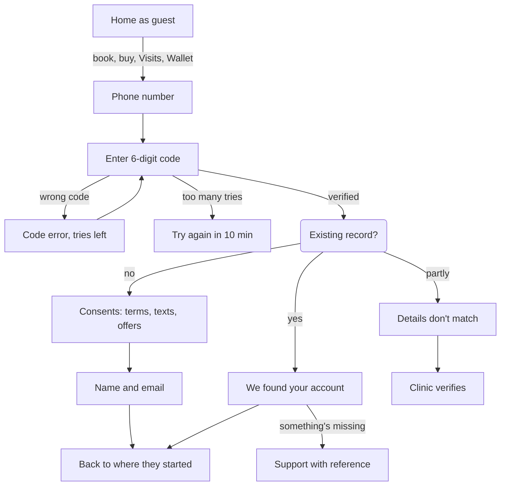

Three outcomes after the code: new client (consents, then name and email), matched client (review what was brought over), or partial match (nothing merges until the clinic confirms).

| Step | States to design |
| --- | --- |
| Phone number | Empty, invalid number, sending, network error |
| Code | Entering, autofilled, wrong code, expired code, resend timer, rate limited |
| Consents | Three separate checkboxes; terms and texts required; offers unticked (AUTH 09) |
| Account match | Matched with items, mismatch, not found (A6) |
| Session | Expired session sends the client back to Phone number with a one-line reason |

## Flow 2 — Discover a treatment

Three doors lead to one treatment detail page: a category, a concern, or search. Detail always ends in one action, Book or Book a consultation (DISC 02–10).

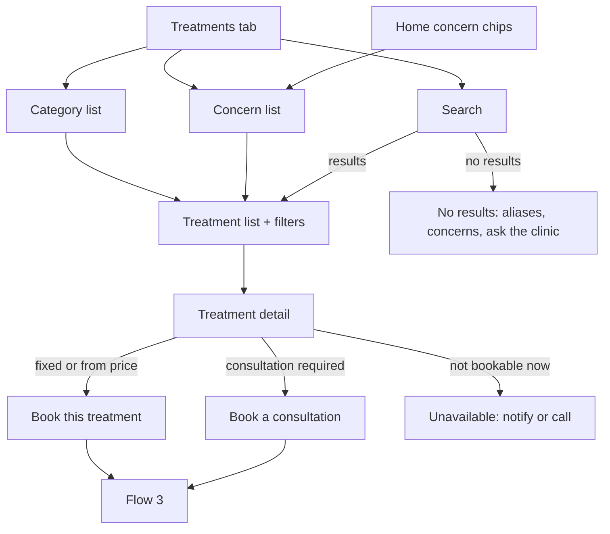

The list screen is shared by categories, concerns and search results; filters (price type, duration, professional) open in a sheet.

| Screen | States to design |
| --- | --- |
| Treatments tab | Categories + concerns + search field; offline shows cached list with a banner |
| Treatment list | Loaded, filtered, empty after filters (reset), loading skeleton |
| Search | Typing suggestions, results, no results, alias match (“botox” → approved name) |
| Treatment detail | Fixed, from, range, per unit, consultation, promo price; photo or placeholder; preparation and suitability rows; professionals who perform it |
| Unavailable | Temporarily unavailable, archived (deep link to an old treatment) |

## Flow 3 — Book an appointment

Booking is five steps (service, professional, time, details, review) and skips any step already known. A time is held for 10 minutes (A3); nothing is booked until the confirmation comes back (BOOK 01–07).

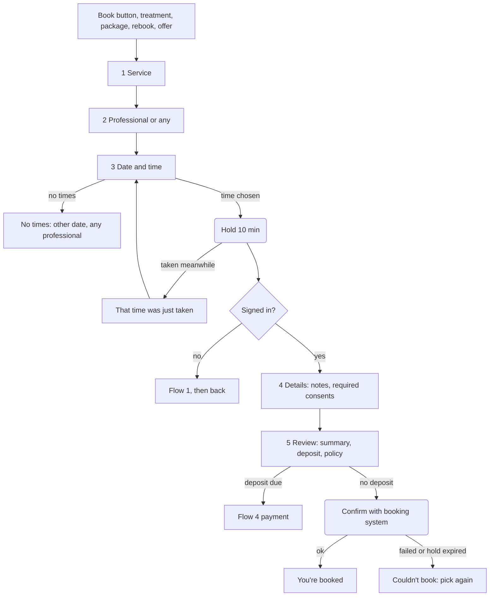

Every entry point pre-fills what it knows: a treatment detail skips step 1, a rebook fills steps 1–2, a package session shows “Uses 1 of 4 sessions” on review (BOOK 14).

**Fresha hand-off variant (if A1 turns out false):** Review → banner “Booking continues with Fresha” → Fresha → back in the app → “Checking your booking…” → either You're booked, or “We couldn't confirm yet” with a Check again button and the clinic's number. Steps 1–2 stay in the app so clients still choose from our catalogue.

| Step | States to design |
| --- | --- |
| Professional | Any professional (first), each eligible person, ineligible shown disabled with reason |
| Date and time | Week strip, checking availability, times, no times, slot taken, hold countdown text |
| Details | Notes (optional), required consents only; no medical questions until approved (BOOK 05, NFR 06) |
| Review | Summary, deposit and amount due later (A4), policy (A2), hold expiring warning at 2 min, hold expired |
| Result | Booked (reference, add to calendar, prep link), couldn't book, offline before submit |

## Flow 4 — Pay

One payment flow serves deposits, packages and gift cards. The result screen appears only after the payment provider answers, and every failure says whether money moved (PAY 01–09, PAY 12).

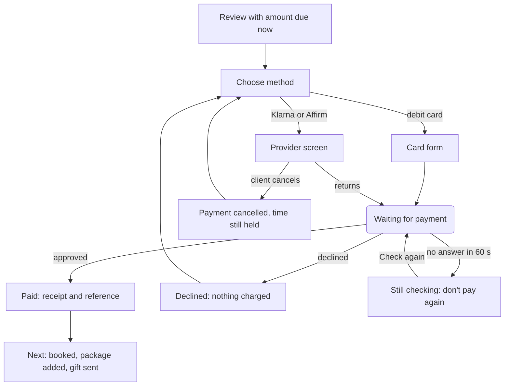

Klarna and Affirm appear only when the purchase is eligible; otherwise their row says why, neutrally (PAY 04). A retry never creates a second charge (PAY 06).

| Screen | States to design |
| --- | --- |
| Choose method | Debit selected, Klarna/Affirm available, unavailable with reason, no methods (call the clinic) |
| Card form | Empty, card error, 3-D Secure check, processing |
| Provider screen | Leaving the app notice, returning, app closed mid-payment (resume on next launch) |
| Waiting | Pending with provider name; never longer than the real request |
| Results | Paid, declined, cancelled, timeout, hold expired during payment (refund automatic, message says so) |
| Receipt | Itemised: treatment, deposit, tax, method, reference (PAY 08) |

## Flow 5 — Manage visits

The Visits tab lists upcoming and past visits; each visit opens a detail page that shows the policy before any change. Inside 48 hours (A2), changes go to the clinic instead of happening instantly (BOOK 08–12).

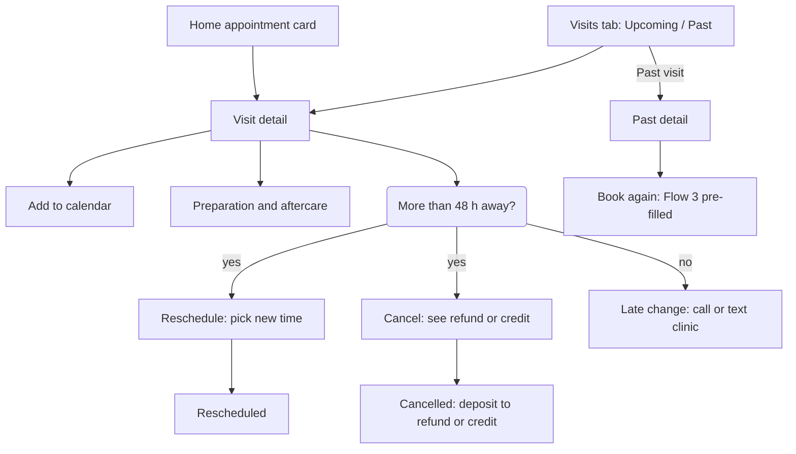

Cancel always shows the money consequence in the confirmation dialog, and the safe choice (Keep it) sits on the left.

| Screen | States to design |
| --- | --- |
| Visits tab | Guest (sign in), empty upcoming, upcoming list, past list, offline cached |
| Visit detail | Confirmed, awaiting clinic, change requested, cancelled, completed, missed |
| Reschedule | Time picker (Flow 3 step 3), no times, confirm, failed |
| Cancel | Consequence dialog, cancelled with refund or credit status (BOOK 10) |
| Late change | Explains the 48-hour rule, call and text buttons with the visit reference |
| Calendar | Added, calendar unavailable (copy details instead) |

## Flow 6 — Wallet

Wallet holds everything the client has paid for: clinic credit, packages, gift cards, member status and receipts. Buying a package or gift card reuses Flow 4; every balance comes from the ledger and shows “checking” rather than an old number (WALT 01–12, MEM 02).

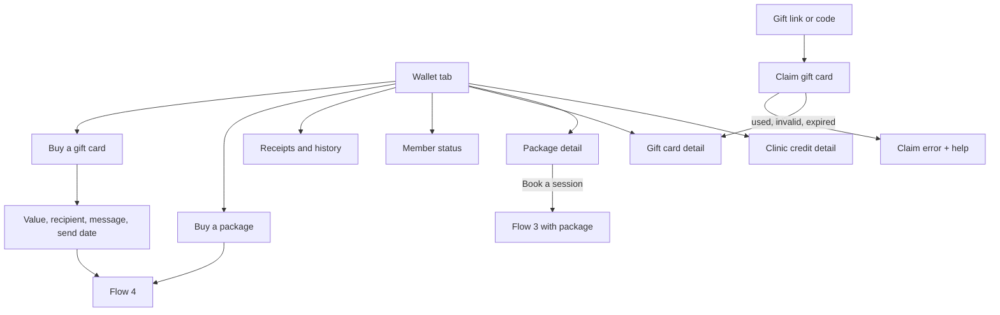

A gift recipient opens the link or types the code; claiming needs sign-in (Flow 1) and adds the card to their Wallet (WALT 04).

| Screen | States to design |
| --- | --- |
| Wallet tab | Guest (sign in + buy gift card), empty (nothing yet), full, reconciling, offline cached with timestamp |
| Clinic credit | Available, pending, expiring, history, non-cash note (WALT 10) |
| Package | Sessions left, booked, used, expiring, expired, fully used |
| Gift card | Balance, history, masked code, sent/scheduled/claimed status for buyer |
| Buy gift card | Preset or custom value (A7), recipient by email or text, message, send now or later, review |
| Claim | Valid, already claimed, invalid code, not found (support) |
| Member status | Active tier, benefits, “new memberships not offered” note (MEM 02) |
| Discrepancy | “Something's wrong with my balance” → support with reference (WALT 11) |

## Flow 7 — Offers and deep links

Offers reach clients from Home (at most two), push notifications, texts and web links; all land on one offer page with terms before any purchase. Expired or paused offers never dead-end (PROMO 03–06, PROMO 09, LEG 07).

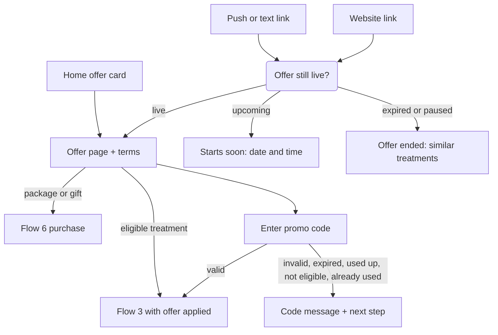

Countdowns are plain text from server time (“Ends 31 Oct, 11:59 pm PT”); nothing flashes or auto-advances.

| Screen | States to design |
| --- | --- |
| Offer page | Live, upcoming, ended, paused, audience-limited (“for returning clients”) |
| Terms | Full terms sheet, eligible treatments list, exclusions |
| Promo code | Five error states from PROMO 06 plus success |
| Deep link landing | Offer, treatment, visit, receipt; unknown or old link → Home with a note |

## Flow 8 — Support, notifications, profile, deletion

The profile button (top of Home) opens the account area; support is also one tap from every visit, payment, package and gift card with the reference attached. Deleting an account explains what is kept before asking for a code (SUP 01–04, NOTIF 04–05, AUTH 04–06, PRIV 01–08).

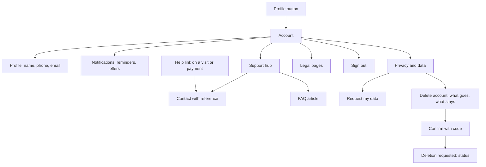

When an upcoming visit or unused balance exists, the deletion screen lists them and suggests cancelling, using or asking the clinic first, but the client can still continue (store rules require a real path to delete; PRIV 04, WALT 12).

| Screen | States to design |
| --- | --- |
| Profile | View, edit, phone change (re-verify), save error |
| Notifications | Reminders on/off, offers off by default, booking messages locked on; system permission off (open settings) |
| Inbox | Messages, empty, message detail, expired offer message (NOTIF 05) |
| Support hub | FAQ, contact (call, text), hours (A8), urgent-care note, channel unavailable after hours |
| Contact | Reference attached, choose channel, sent confirmation |
| Delete account | Explanation, warnings (visit, balance), code confirm, requested, completed notice |
| Legal | Terms, privacy, consent detail; offline cached copy |

## Flow 9 — Staff workspace

> **Superseded by Flow 9 v2 (D34, D35).** Kept for history: this version assumed five roles and a required second approver. Build from Flow 9 v2 below.

Every staff change follows one lifecycle: draft → submit → approve or send back with a reason → scheduled or live → paused or expired. The server checks the role at each step; every step writes an audit entry (ADMIN 01–10).

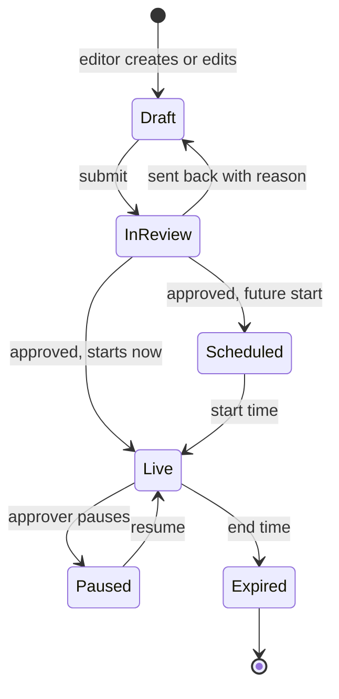

High-risk changes (price, policy, offer terms) need a second approver who is not the submitter (ADMIN 08). Price and policy changes stay in draft until approved; customers never see them early.

| Screen | States to design |
| --- | --- |
| Staff home | Counts: waiting approvals, live offers, drafts; no role (PermissionNotice) |
| Services list and edit | Draft, submitted, live, archived; validation (policy can't be a service, price type required); photo rights field. Categories and concerns are edited here too: rename, reorder, add, move a treatment, hide (D29) |
| Campaign edit | Schedule with timezone, eligibility, terms, destination, customer preview, validation errors |
| Approvals | Queue, item diff (before → after), approve, send back (reason required), second approver needed |
| Value lookup | Search by reference, ledger trail, propose adjustment (finance approves) |
| Audit log | Filter by person, item, date; read-only |
| Conflicts and errors | Edit conflict, offline (read-only), save failed, permission denied |

## Screen inventory

> **Superseded by design v1.2.** This inventory lists the 92 screens of v1.0. The canvas now has 158 boards; the current list with routes, roles, booking modes and states is in `routes.json` and the Phase 7 doc (“New routes and state contracts”).

92 screens (about 190 with their states) go into Phase 6, in two batches: batch 1 has no outside dependency; batch 2 uses the assumptions above. Every screen is drawn in light and dark.

| Area | Screen IDs | Count | Batch |
| --- | --- | --- | --- |
| Entry | ENT-01 Splash · 02 Update required · 03 Maintenance · 04 Notification primer | 4 | 1 |
| Sign-in | AUT-01 Phone · 02 Code · 03 Consents · 04 Name and email · 05 Matched · 06 Mismatch · 07 Not found · 08 Session expired / rate limited | 8 | 1 (05–07 on A6) |
| Home | HOM-01 Guest · 02 With visit · 03 No visit | 3 | 1 |
| Treatments | TRT-01 Tab · 02 List · 03 Filters · 04 Search · 05 Detail · 06 Professional · 07 Unavailable | 7 | 1 |
| Offers | OFR-01 Offer · 02 Terms · 03 Promo code · 04 Ended / upcoming | 4 | 1 |
| Account | ACC-01 Account · 02 Profile · 03 Notifications · 04 Inbox · 05 Message · 06 Privacy · 07 Data request · 08 Delete explain · 09 Delete confirm · 10 Delete requested · 11 Legal | 11 | 1 |
| Support | SUP-01 Hub · 02 Article · 03 Contact | 3 | 1 |
| Care | CAR-01 Preparation and aftercare | 1 | 1 |
| Staff | STF-01 Home · 02 Services · 03 Service edit · 04 Categories and concerns · 05 Campaigns · 06 Campaign edit · 07 Preview · 08 Approvals · 09 Approval detail · 10 Support content · 11 Value lookup · 12 Audit log · 13 Team and roles · 14 No permission | 14 | 1 |
| Booking | BKG-01 Service · 02 Professional · 03 Date and time · 04 Details · 05 Review · 06 Booked · 07 Couldn't book · 08 Fresha hand-off · 09 Fresha return | 9 | 2 |
| Payment | PAY-01 Method · 02 Card · 03 Leaving for provider · 04 Waiting · 05 Paid · 06 Declined · 07 Cancelled · 08 Timeout · 09 Receipt | 9 | 2 |
| Visits | VIS-01 Tab · 02 Detail · 03 Reschedule · 04 Cancel · 05 Cancelled · 06 Late change · 07 Past visit | 7 | 2 |
| Wallet | WAL-01 Tab · 02 Credit · 03 Package · 04 Gift card · 05 Member · 06 History · 07 Buy package · 08 Gift value · 09 Gift recipient · 10 Gift review · 11 Claim · 12 Balance help | 12 | 2 |
| **Total** |  | **92** | 55 + 37 |

- [ ] You approve these flows as the base for Phase 6 (or comment on any step)

## v2 (Phase 9, 25 Sep): what changed

Flows 3, 4, 6, 8 and 9 are revised and nine flows are added (3H and 10–17) to close the Phase 9 gaps. Assumptions A1–A8 are now staff settings (D37) with the same sample values; A1 becomes the booking-mode setting (D33).

| Setting value | Mode | Booking happens | Visits in the app |
| --- | --- | --- | --- |
| `handoff` (default) | H | In Fresha, opened in an in-app browser | Shown if the app can read Fresha appointments; otherwise an explanation and an Open Fresha button |
| `inapp` | A | In the app (needs a booking system with an API) | Full list, reschedule and cancel in the app |

Screens that differ by mode have a mode switch in Tweaks: HOM-02, HOM-03, BKG-08, BKG-09, VIS-01, VIS-02. Every flow below ends in a success, a failure and a recovery state.

## Flow 3H — Booking, hand-off mode (new)

The client chooses treatments in the app, then Fresha finishes the booking in an in-app browser; the app never claims a booking it can't see (BOOK 01–12, D33).

> **Updated 25 Sep (CR-42, CR-43).** Hand-off now passes through BKG-01 (and BKG-10 for laser areas) before the explainer; the basket (BKG-11) stays in-app only. Prefill and visit sync depend on Fresha and are marked as assumptions.

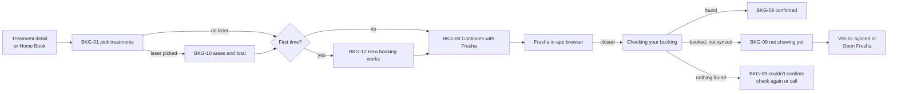

Home (HOM-02/03) and Visits (VIS-01/02) show synced visits when the app can read them; otherwise they say bookings live in Fresha and offer Open Fresha. Late-change requests still reach the clinic (Flow 12).

## Flow 3 v2 — Booking, in-app mode (revised)

Clients can put several treatments or several laser areas in one visit before choosing a professional and time (BOOK 01–06, DISC 07).

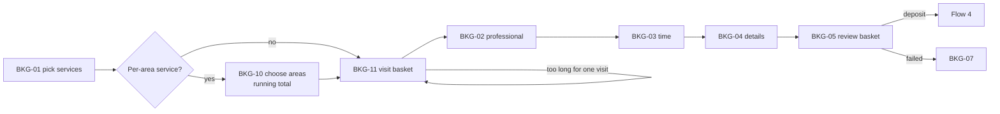

The basket warns when the total time is too long for one visit and suggests splitting it. Consultation shows $20, credited to the treatment (setting).

## Flow 4 v2 — Pay (revised)

Apple Pay and Google Pay come first when switched on; they also carry Interac debit. The method list comes from settings (PAY 01–05, 12).

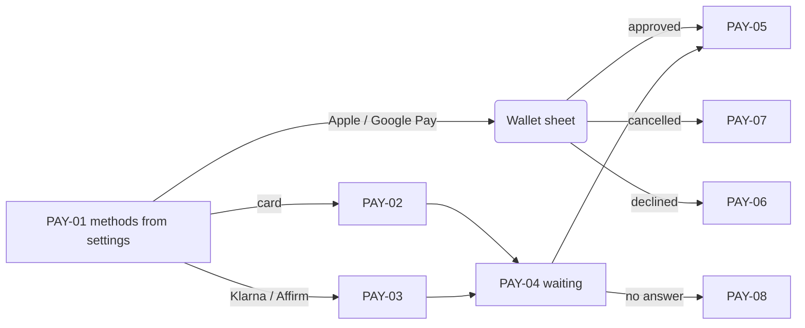

## Flow 6 v2 — Wallet (revised)

Gift purchase starts with a design; membership appears only for legacy members; counter redemptions show in history with a receipt (WALT 01–08, MEM 02, D38).

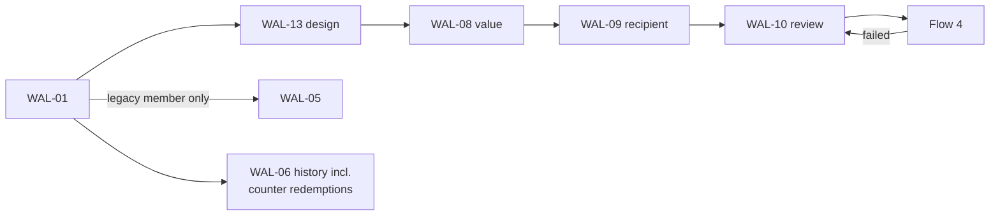

## Flow 8 v2 — Support and account (revised)

The help hub adds directions, parking and “Not sure? Ask us”; requests reach the staff inbox and replies land in the customer inbox (SUP 01–04, NOTIF 05).

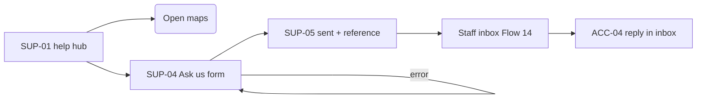

## Flow 9 v2 — Staff content lifecycle (revised)

The Owner publishes after a confirm step; Editors submit to the Owner; a second approver is optional (D34–D36). Live items are archived, not deleted.

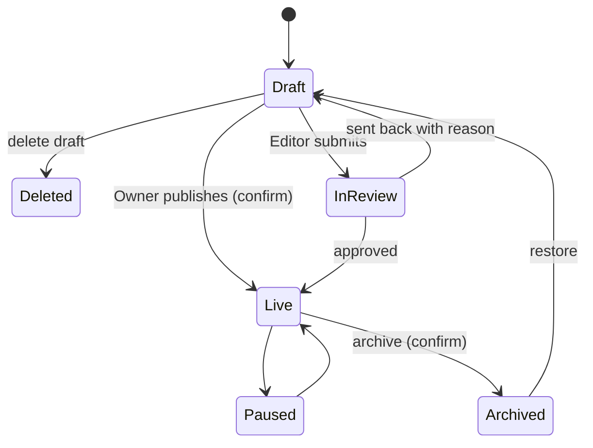

With the second-approver setting on, price, policy and offer-term changes go to In review even for the Owner, and need a different person. Save failures and version conflicts keep the draft (STF-03 states).

## Flow 10 — Counter redemption (new)

Front desk uses a package session or gift-card amount at checkout; the ledger updates only after confirm (WALT 04, 07, 08).

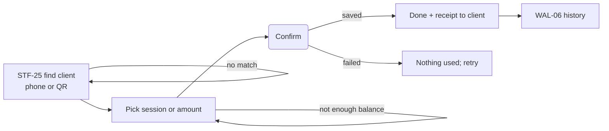

## Flow 11 — Gift recipient (new)

A scheduled gift arrives by text or email; recipients without the app claim it on a web page (WALT 02–04).

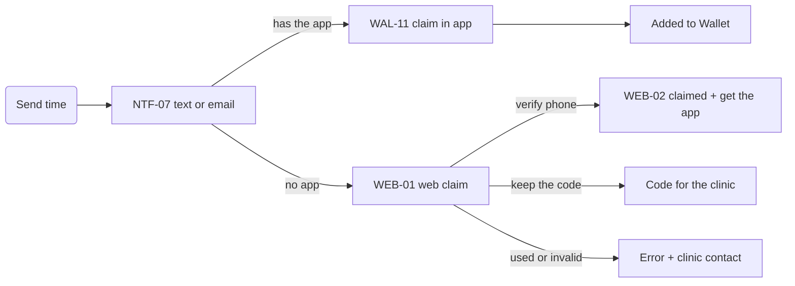

## Flow 12 — Appointment requests (new)

Late changes, cancel requests and “awaiting clinic” visits land in one staff queue; the client is told the outcome (BOOK 08–10, SUP 02).

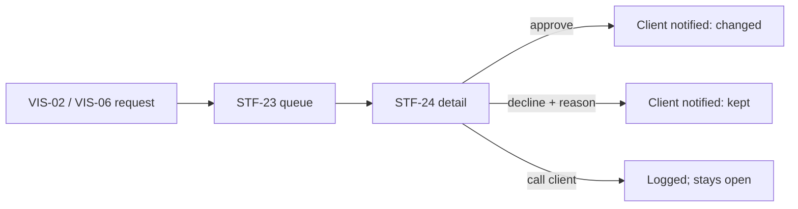

## Flow 13 — Account match check (new)

A mismatch from sign-in becomes a staff case; value moves only after staff confirm (AUTH 11, LEG 04, ADMIN 09).

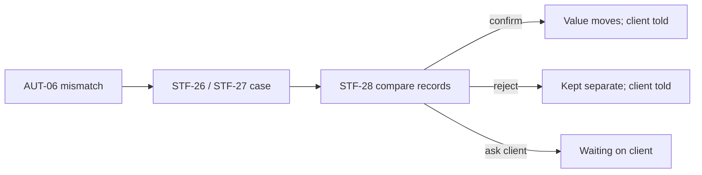

## Flow 14 — Support inbox (new)

Contact, balance-help and Ask-us messages share one inbox; replies go by text, email or in-app message (SUP 03–04, ADMIN 09).

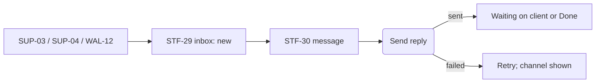

## Flow 15 — Content admin pattern (new)

Packages, gift settings, promo codes, professionals, policies, Home layout, push and media all follow one pattern (ADMIN 02–05, PROMO 01–07).

```mermaid
flowchart LR
  L[List: search, filter, status] --> E[Sectioned edit]
  E -->|invalid| E
  E --> P[Preview as customer]
  P --> S(Save draft / Publish / Submit)
  S -->|conflict or failed| E
  S --> LV[Live]
  LV --> A[STF-39 archive, restorable]
```

## Flow 16 — Catalogue import (new)

The clinic's Fresha service export seeds the catalogue once, reviewed before publishing (ADMIN 02, DISC 02, 09, D40).

```mermaid
flowchart LR
  F[STF-41 choose file] --> C[Match columns]
  C -->|missing column| C
  C --> R[STF-42 review new,<br/>changed, duplicates]
  R -->|conflicts| X[Fix or skip]
  X --> R
  R --> P(Publish selected)
  P --> OK[Published; audit entry]
```

## Flow 17 — Settings change (new)

Rule changes show what they affect and apply to new bookings only (ADMIN 06, PAY 05, 12, D37).

```mermaid
flowchart LR
  E[STF-31 / STF-32 edit] --> I(Impact: new bookings only;<br/>closure overlaps 2 bookings)
  I --> C(Confirm)
  C -->|saved| A[Audit entry; customer screens update]
  C -->|failed| E
```

Every new screen in Phase 9 appears in at least one flow above or in Flows 3H–17.
