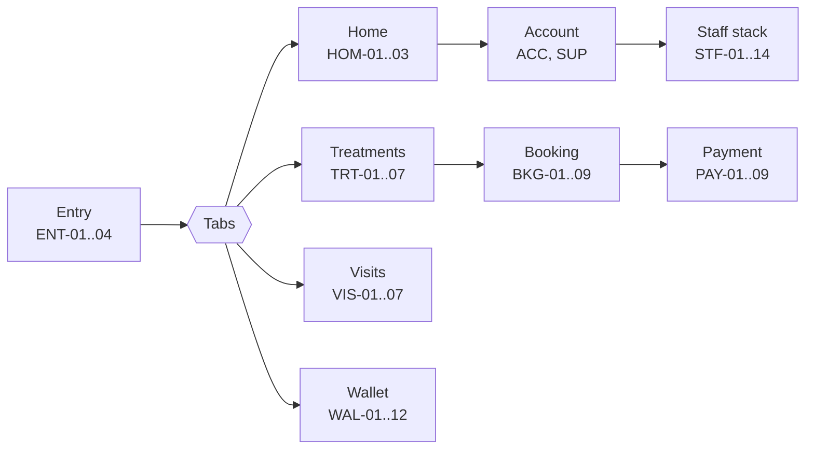

# Nano Beauty App — Phase 7 Developer Handoff

Sep 25, 2026 · @Dragon

> **Version 1.2 (Phase 9, 25 Sep 2026).** Sections from “Handoff v1.2” onward replace the older text where they differ: roles (D34), approval as a setting (D35), archive rules (D36), settings instead of fixed rules (D37), two booking modes (D33), 57 new boards, 29 revised.

## What's in the handoff

This pack lets a React Native developer build all approved screens (158 boards in v1.2), their states, the staff workspace and the motion rules without asking design questions. Everything marked Sample waits on the owner named in the last section.

| Source | What it holds | Link |
| --- | --- | --- |
| Design canvas | 158 boards: 126 app screens, 7 tablet layouts, 4 web pages, 12 notification templates, 8 motion prototypes, app icon; states in Tweaks; light/dark and iOS/Android switches | [Nano Beauty App Screens](https://claude.ai/code/artifact/2358cea3-5eab-4c94-a54a-058fad95e625) |
| Design system | Tokens, 62 components with READMEs, 13 guidelines, token exports, fonts, logo, icons, photos | [Nano Beauty design system](https://claude.ai/artifact/3uT3fESwWqALaQK6UjS3Uj) |
| Phase 0 register | Decisions D01–D40 (D33, D34, D35, D38 pending client confirmation), change requests CR-01–58, conflicts, risks, phase status and QA results | [Phase Plan & Phase 0 Register](https://claude.ai/code/artifact/3fc19c3f-98d4-47a5-bb8f-bffb1592407a) |
| Phase 3 flows | Flows 1–9, v2 flows (3H hand-off, 3, 4, 6, 8, 9 v2) and new flows 10–17; the sample rules A1–A8 (now settings, spec 1); the v1.0 screen inventory (superseded by routes.json) | [Phase 3 Flows](https://claude.ai/code/artifact/da8c706e-1916-4a6c-81b9-3359e7a84761) |
| App icons | Approved icon with iOS and Android export set | In the handover pack: assets/app-icon/final/ (also nano-beauty-app-icon-final.zip in the Nano Beauty Design System folder) |

How to read the canvas:

- Each board is one screen at 390 × 844 pt. The ID in its title (BKG-05) is the screen ID used in this pack.
- Open a board's Tweaks to switch theme, platform and state. Every state listed below is a Tweaks option.
- Press Play on a board to click through the prototype. Tab bars and top-bar back arrows are static there; the app uses the native navigator.
- The web components are the visual and behavioural reference, not code to ship. Build native components with the same props and states.

## Route map

There are four customer tabs (Home, Treatments, Visits, Wallet), with Account and support opened from the Home header. The staff workspace is a separate stack reached from Account. Route names are proposals for Expo Router; the IDs are fixed.

Sign-in starts only when a guest books, buys, or opens Visits or Wallet, then returns them to where they were (AUTH 11).

| Route | Screens | Sign-in | Notes |
| --- | --- | --- | --- |
| `/` (splash, gates) | ENT-01–04 | No | Update-required and maintenance come from a remote config check |
| `/(tabs)/home` | HOM-01 guest, HOM-02 with visit, HOM-03 no visit | No | Variant chosen from session + next appointment |
| `/(tabs)/treatments` | TRT-01 | No | Categories, concerns, search entry |
| \`/treatments/list?category | concern\` | TRT-02, TRT-03 filters sheet | No |
| `/treatments/search` | TRT-04 | No | Aliases map to approved names |
| `/treatments/[id]` | TRT-05, TRT-07 unavailable | No | Price kind drives the CTA |
| `/professionals/[id]` | TRT-06 | No |  |
| `/offers/[id]`, `/offers/[id]/terms`, `/promo` | OFR-01, OFR-02, OFR-03, OFR-04 | No | Deep links land here; ended or unknown links fall back safely |
| `/auth/phone`, `/code`, `/consents`, `/profile`, `/match` | AUT-01–08 | — | `returnTo` param restores the start point |
| `/book/service` → `/professional` → `/time` → `/details` → `/review` | BKG-01–05 | From step 4 | Steps already known are skipped |
| `/book/result`, `/book/fresha`, `/book/fresha-return` | BKG-06–09 | Yes | BKG-08/09 only if booking can't happen in the app (A1) |
| `/pay/method`, `/card`, `/provider`, `/status`, `/receipt/[id]` | PAY-01–09 | Yes | One flow for deposits, packages and gift cards |
| `/(tabs)/visits`, `/visits/[id]`, `/reschedule`, `/cancel`, `/late-change` | VIS-01–07 | Yes | Cancel is a dialog over visit detail |
| `/care/[visitId]` | CAR-01 | Yes |  |
| `/(tabs)/wallet` and `/wallet/credit`, `/packages/[id]`, `/gift-cards/[id]`, `/membership`, `/history` | WAL-01–06 | Yes (guest sees WAL-01 guest state) |  |
| `/wallet/buy-package`, `/wallet/gift/value` → `/recipient` → `/review` | WAL-07–10 | Yes | Guests may start a gift; sign-in before paying |
| `/wallet/claim?code`, `/wallet/help` | WAL-11, WAL-12 | Yes | Claim links open from text or email |
| `/account/...` | ACC-01–11 | Yes | Profile, notifications, inbox, privacy, delete, legal |
| `/support`, `/support/[article]`, `/support/contact?ref` | SUP-01–03 | No | Contact carries the reference of where it was opened |
| `/staff/...` | STF-01–14 | Staff role | Hidden unless the server confirms a role |

## Screen state contracts

41 screens have 85 extra states beyond their default; each state below is a Tweaks option on that board, and the default is listed first. Three rules apply everywhere:

1. **Truth first:** a booking, payment, refund, claim or balance shows success only after the system of record answers. Until then the screen says what it is waiting for.
2. **Offline:** show the last saved copy with its time and an offline banner. Anything that changes money or time is disabled until back online.
3. **Every failure says whether money moved** and offers one next step.

| Screen | States | Shown when |
| --- | --- | --- |
| HOM-01 Guest home | ready, loading, offline, oldlink | loading = first fetch; oldlink = a deep link that no longer resolves |
| HOM-02 Home with visit | ready, offline | offline = no network, data from cache |
| TRT-02 Treatment list | loaded, empty, loading | empty = filters match nothing (offer Clear filters) |
| TRT-04 Search | noresults, typing, results | results shows the approved name when an alias matched |
| TRT-05 Treatment detail | from, fixed, range, perunit, consultation, promo | price kind from the catalogue; consultation swaps the CTA to Book a free consultation |
| TRT-07 Unavailable | unavailable, archived | archived = old link to a treatment no longer offered |
| OFR-01 Offer | live, upcoming, paused, returning | from campaign state and audience; paused hides offer prices |
| OFR-03 Promo code | ended, invalid, usedup, noteligible, alreadyused, valid | the five PROMO 06 errors plus success |
| AUT-01 Phone | filled, empty, invalid, sending, network | network = request failed, no code sent |
| AUT-02 Code | entering, wrong, expired | wrong shows tries left; expired sends a new code |
| AUT-08 Session | expired, limited | limited = too many code attempts (10 min) |
| BKG-03 Date and time | ready, checking, none, conflict | conflict = slot taken during the hold request |
| BKG-04 Details | ready, error | error = required consent missing |
| BKG-05 Review | deposit, expiring, expired, package | expiring at 2 min left; expired after 10 min (A3) |
| BKG-07 Couldn't book | failed, offline | offline = nothing was sent |
| BKG-09 Fresha return | checking, confirmed, notyet | notyet = no confirmation within the timeout |
| PAY-01 Method | deposit, package, none | Klarna/Affirm rows from eligibility; none = no online method available |
| PAY-02 Card | filled, empty, error, verify | verify = 3-D Secure check open |
| VIS-01 Visits | upcoming, past, empty, guest, offline |  |
| VIS-02 Visit detail | early, late, requested | late = under 48 h (A2): changes go to the clinic |
| VIS-03 Reschedule | ready, none, failed | failed keeps the original time |
| VIS-04 Cancel | refund, package | the money consequence is always in the dialog |
| VIS-07 Past visit | completed, missed |  |
| WAL-01 Wallet | full, reconciling, offline, empty, guest | reconciling hides values until the ledger confirms |
| WAL-02 Credit | available, expiring, reconciling |  |
| WAL-03 Package | active, expiring, expired, used |  |
| WAL-04 Gift card | mine, sent | sent = buyer's view with send status |
| WAL-08–09 Gift purchase | preset, custom, error · now, later | custom amount $25–$500 (A7) |
| WAL-11 Claim | valid, invalid, claimed, notfound | claimed and notfound show support with a reference |
| WAL-12 Balance help | form, sent |  |
| ACC-02 Profile | view, phone, error | phone = new number must be verified before saving |
| ACC-04 Inbox | list, empty |  |
| ACC-10 Deletion | requested, completed |  |
| ACC-11 Legal | online, offline | offline = saved copy with version |
| SUP-03 Contact | closed, open, sent | from clinic hours (A8) |
| STF-03 Service edit | draft, conflict, offline, savefailed | conflict = version mismatch; no force-save |
| STF-06 Campaign edit | error, valid | submit blocked until valid |
| STF-08 Approvals | waiting, empty |  |
| STF-09 Approval detail | reject, approve | reject needs a reason |
| STF-11 Value lookup | found, notfound |  |

State flags live in the screen's view model, not in component props scattered across the tree. The canvas boards show the exact copy for each state.

## Roles and permissions

Five staff roles (D25) sit on top of the customer account; the server checks the role on every request, and the app only mirrors it. A person can hold more than one role, but high-risk changes always need a second approver who didn't submit them (ADMIN 08).

> **Replaced in v1.2.** Three roles now (Owner, Editor, Front desk; D34) and the second approver is an optional setting (D35). See “Roles v2” below.

| Action | Content editor | Approver | Support | Finance | Administrator |
| --- | --- | --- | --- | --- | --- |
| See staff workspace | Yes | Yes | Yes | Yes | Yes |
| Draft or edit services, categories, concerns | Yes | Yes | — | — | — |
| Draft or edit campaigns and support content | Yes | Yes | — | — | — |
| Submit for approval | Yes | Yes | — | — | — |
| Approve, send back (reason required) | — | Yes, not own | — | — | — |
| Publish, pause, roll back | — | Yes | — | — | — |
| Look up bookings and value by reference | — | — | Yes | Yes | Yes |
| Log a note, propose a balance fix | — | — | Yes | Yes | — |
| Approve a balance adjustment or refund | — | — | — | Yes | — |
| Manage team, roles, settings | — | — | — | — | Yes |
| Read audit log | Own items | Yes | Own actions | Yes | Yes |

Server rules the build must enforce:

- High-risk fields (price, price type, policy text, offer terms, gift values) move an item to In review; customers keep seeing the live version until approval.
- Every change writes an audit entry: actor, role, item, field, old value, new value, reason, time, device. Audit entries can't be edited or deleted.
- Saves carry the item version. A mismatch returns 409 and the app shows the edit-conflict state; there is no force-save.
- Staff sessions time out sooner than customer sessions and need the same verified phone plus the role grant.
- A denied action returns 403 with the missing permission; the app shows STF-14.
- Staff roles never grant access to clinical or patient notes. Value lookup shows ledger lines only.

## Motion recipes

The eight MOT boards on the canvas are playable; switch Tweaks → motion to Reduced to see the Reduce Motion version. Durations and easings are the tokens in `nano-tokens.ts` (`duration.*`, `easing.*`); native navigation, sheets and the keyboard keep their platform motion.

| Board | Trigger | Normal motion | Reduce Motion | Acceptance |
| --- | --- | --- | --- | --- |
| MOT-01 Tabs and filters | Tap a tab or a filter chip | Tab panel and list fade in over `state` (180 ms) with 8 pt rise | Instant, or 80 ms fade | Selected tab is also bold label + filled icon; list count text updates |
| MOT-02 Slot selection | Tap a time, then Continue | Slot colour change `feedback` (120 ms); hold note reveals after the server answers | No colour transition; note appears | Never shows Held before the hold request succeeds; slot loss clears the pick and explains |
| MOT-03 Booking confirmation | Confirm booking | Button spinner while waiting; result reveals over `reveal` (240 ms) | Result appears with 80 ms fade | No success before confirmation; failure says nothing was charged |
| MOT-04 Payment result | Pay | Pending status only while the request is open; result reveal 240 ms | 80 ms fade | Timeout says don't pay again; retry never double-charges |
| MOT-05 Wallet reconciliation | Refresh balance | Value hidden with Checking text; new value fades in once | Direct swap | No count-up or rolling digits |
| MOT-06 Offer expiry | Server time passes the end | Time left updates as text each second; ended state reveals 240 ms | Text only; ended state appears | Nothing flashes; ended offer points to a safe destination |
| MOT-07 Publish and send back | Approve / Send back | Status badge swap 180 ms; result banner 240 ms | Instant swap | Send back without a reason shows an inline error, no shake |
| MOT-08 Sheet dismissal | Open note sheet; close or tap outside | Sheet rises over `overlay` (280 ms, enter easing), leaves with exit easing; scrim fades | Sheet and scrim fade 80 ms, no slide | Unsaved text asks before discarding; system Back and swipe-down behave the same |

Haptics: a light selection tick on slot and chip selection, a success tick only after a confirmed booking or payment, and none on errors. Respect the OS Reduce Motion setting live, including changes while the app is open.

## Assets and sizes

Use only the full nano BEAUTY lockup or the master square; never a “nano”-only mark (owner rule).

| Asset | Files | Use |
| --- | --- | --- |
| Logo | `nano-beauty-logo-master.svg` (2592 × 2592 plum square), `nano-beauty-lockup-plum.svg`, original PDF | Lockup in headers at 26–38 pt tall; master square on the splash at 300 pt |
| App icon | `nano-beauty-app-icon-final.zip`: `ios/AppIcon-1024.png`, `android/ic_launcher_foreground.png` + `_background.png` (432 px, 108 dp), `_monochrome.png`, `play-store-512.png`, SVG sources | Approved (D30): use nano-beauty-app-icon-final.zip |
| Fonts | Fraunces (variable + italic) and Sora (variable), SIL Open Font License | Ship static TTFs from Google Fonts in the app; the woff2 files are for the web reference |
| Icons | Phosphor Regular, 20 and 24 pt; filled variants only for the selected tab | Bundle `phosphor-react-native` or export the used SVGs |
| Photos | 9 website photos in WebP, 661–1600 px wide | Rights and team consent still to confirm (R07) |

Photo crops used on the screens (width : height):

| Where | Ratio | Export at 3× for a 350 pt wide slot |
| --- | --- | --- |
| Guest home hero | 16 : 11 | 1050 × 722 px |
| Treatment detail, stacked service card | 16 : 10 | 1050 × 656 px |
| Treatment list card | 5 : 2 | 1050 × 420 px |
| Offer card and page | 16 : 9 | 1050 × 591 px |
| Service row thumbnail | 104 pt square-ish, fills height | 312 × 312 px |
| Category tile | 76 pt tall, fills column | 510 × 228 px |
| Professional portrait | 3 : 4 | 1050 × 1400 px |

Faces stay in the centre third so every crop keeps them. The laser (661 px) and PRP (860 px) photos are below 3× for full-width use; ask the clinic for larger originals.

## Test data fixtures

The design system now ships `export/fixtures.json` and `export/routes.json`. The fixtures hold exactly the sample data on the canvas, so screenshots from the build can be compared one-to-one with the boards. Every value is a placeholder until its owner confirms it.

| Fixture | Sample values |
| --- | --- |
| Client | Maria Chen, (604) 555-0123, client since 2025; texts on, offers off |
| Next visit | NB-20418 · 12D HIFU Full face · Thu 16 Oct 2026, 2:30 pm PT · Naz · $50 deposit paid (PAY-88213), $300 due at the visit |
| Other visits | NB-20533 laser, 13 Nov, awaiting clinic; NB-19877 laser, 28 Aug, completed |
| Clinic credit | $40 (+$50 late cancellation 12 May, −$10 used 28 Aug) |
| Package | Laser underarm, 3 of 6 left, use by 28 Feb 2027 |
| Gift card | •••• 4821, $95 (+$115 from the old app, −$20 used 12 Sep) |
| Sent gift | $100 to Sara by text, scheduled 24 Dec, 9:00 am PT |
| Membership | Glow member since March 2024, 3 benefits, from the old app |
| Campaigns | Autumn laser 15% (live, ends 31 Oct), Winter glow facials (scheduled 1 Nov), Holiday gift cards (in review) |
| Rules | A2 48 h, A3 10 min hold, A4 $50 over $150, A7 $50/$100/$150/$200 or $25–$500 |

`routes.json` lists 108 (v1.2) routes with their screen IDs and whether they need sign-in or a staff role, matching the route map above.

## QA checklist for the built app

Run this on a current iPhone and a mid-range Android phone before each test build goes to the owner (Phase 8). A screen passes when every line holds in light and dark.

- [ ] Layout matches the board at 390 pt width: spacing, type roles, colours from tokens, no hard-coded hex values
- [ ] Every state in the state contract table exists and shows the same copy as its board
- [ ] Text at 200% system size reflows; prices, buttons and error messages stay visible
- [ ] VoiceOver and TalkBack read each control's label, role and state; focus moves to the new step or error
- [ ] Touch targets are 48 pt/dp or larger
- [ ] Contrast pairs from the design system contrast report hold in both themes
- [ ] Reduce Motion (iOS) and Remove animations (Android) remove all movement; nothing relies on motion alone
- [ ] No booking, payment, refund, claim or balance shows success before the server answers
- [ ] Offline shows the saved copy with its time; money and time changes are disabled
- [ ] Back gesture, Android system Back and swipe-down on sheets never lose typed input without asking
- [ ] Sign-in returns the guest to where they started
- [ ] Staff routes are unreachable without a server-confirmed role; a forced 403 shows STF-14
- [ ] Audit entries appear for every staff change with old and new values
- [ ] Deep links for offers, treatments, visits and receipts land correctly; old links fall back to Home with the note
- [ ] Sample badges are removed only where the owner has confirmed the real content

## Open dependencies, exceptions and starter reconciliation

The design is buildable now; seven inputs change content or rules, not layouts, and each has an owner.

| Dependency | Screens affected | Owner | Until then |
| --- | --- | --- | --- |
| Fresha: API or hand-off, return and errors (R01, A1) | BKG-01–09, VIS-02–06 | Operations + developer | Build in-app booking behind a flag; BKG-08/09 fallback ready |
| Written deposit, hold, cancellation, refund rules (R06, A2–A4) | BKG-05, VIS-02–06, ACC-11 | Clinic | Sample rules with Sample badges |
| Payment provider and merchant accounts for debit, Klarna, Affirm (R03, A5) | PAY-01–09 | Finance + developer | Placeholder “\[payment provider\]” |
| Old-app data export and customer matching (R02, A6) | AUT-05–07, WAL-01–06 | You + developer | Match screens and reconciling states |
| Gift card rules (A7) | WAL-08–11 | Clinic | Sample values |
| Support hours and channels (R10, A8) | SUP-01–03 | Clinic | “\[Clinic hours to confirm\]” |
| Service catalogue, clinical copy, photo rights and team consent (R04, R05, R07) | TRT, CAR, OFR, TRT-06 | Clinic lead | Draft catalogue (D27), placeholders in brackets |

Known exceptions: Play mode can't navigate from tab bars or back arrows (the canvas is a design tool, not the navigator). Everything else in the brief is covered.

Before coding scope-dependent routes, the owner updates the developer starter (D20):

- [ ] Replace Requirements v1.0 with v1.1 and update the traceability file
- [ ] Drop the separate React/Vite `apps/admin` plan; staff tools live inside the app
- [ ] Rewrite NANO-02 to use this route map (4 tabs, no hard-coded Services route)
- [ ] Update NANO-15/16 for the staff routes, roles and audit rules above
- [ ] Confirm Fresha, ledger export and customer identity before any code claims a native booking or wallet

## Handoff v1.2: what changed

Phase 9 closed the 41 gaps found before benchmarking. The pack is now design v1.2.

| Item | v1.1 | v1.2 |
| --- | --- | --- |
| Canvas boards | 101 | 158 (+34 app screens, 7 tablet layouts, 4 web pages, 12 notification templates) |
| Revised boards | — | 29 (14 customer, 10 staff, 5 role-name updates) |
| Design-system components | 45 | 62 (+17 new; PublishState and StaffBar extended) |
| Icons | 57 | 98 |
| Routes in routes.json | 72 | 108 |
| Decisions | D1–D32 | D33–D40 added |

Files: [screens canvas](https://claude.ai/artifact/5NA9BUxqPEpyu4AjJVLt8C) · [design system](https://claude.ai/artifact/3uT3fESwWqALaQK6UjS3Uj) (components, `export/routes.json`, `export/fixtures.json`).

## Booking modes (D33)

One server setting, `bookingMode`, picks the flow. Hand-off (Fresha) is the default because Fresha has no public booking API. Every board that differs has a Tweaks switch `mode: handoff | inapp`; `routes.json` marks each route `both`, `handoff` or `inapp`.

| Screen | Hand-off | In-app |
| --- | --- | --- |
| HOM-02 Home with visit | Visit synced from Fresha, or “Your bookings are in Fresha” + Open Fresha | Visit from our booking record |
| HOM-03 Home, no visit | Book again → BKG-12 / BKG-08 | Book again → BKG-03 |
| TRT-05 Treatment detail | Book and consultation → BKG-12 (first time) → BKG-08; per-area → BKG-10 | Book and consultation → BKG-02; per-area → BKG-10 |
| BKG-01 Service | Pick treatments, then Continue in Fresha → BKG-12; laser → BKG-10 first | Continue → BKG-02; laser → BKG-10 → BKG-11 |
| BKG-10 Choose areas | Area prices and total, then Continue in Fresha → BKG-12 | Continue → BKG-11 |
| BKG-02–07, 11 | Not used (Fresha handles time, deposit, several services) | Main path |
| BKG-08, 09, 12 | Main path: explainer, hand-off, return check | BKG-08 is the backup when booking fails |
| VIS-01 Visits | Synced list, or explanation + Open Fresha | Our records |
| VIS-02 Visit detail | Change in Fresha; within 48 h ask the clinic (VIS-06) | Reschedule and Cancel in the app |
| STF-23 Today | Requests only | Appointments and requests |
| STF-24 Request detail | Move it in Fresha, then Mark as done | Approve and move |

What Fresha passes in (prefill) and whether it shares bookings back (sync) is not confirmed yet; BKG-08 and BKG-12 carry an Assumption badge until it is.

Sync rule: a hand-off booking is “confirmed” only after Fresha reports it (BKG-09 checking → confirmed, not yet, or not showing yet). Never show success on return alone.

## Roles v2 (D34, D35)

Three roles. A person can hold more than one. The server checks the role on every request; the app only hides what a role can't use. Boards show roles with a Tweaks switch `role`.

| Area | Owner | Editor | Front desk |
| --- | --- | --- | --- |
| Today, requests, inbox (STF-23, 24, 29, 30) | Yes | — | Yes |
| Redeem, value lookup, gift-card actions (STF-25, 11, 18) | Yes (void is Owner only) | — | Yes |
| Customers and account match (STF-26–28) | Yes | — | Yes |
| Content: services, categories, FAQ, media, import (STF-02–04, 36, 40–42) | Publish | Draft and submit | — |
| Selling: campaigns, packages, promo codes, Home layout (STF-05, 06, 15, 16, 19, 20, 34) | Publish | Draft and submit | — |
| Gift-card settings, push messages (STF-17, 35) | Yes | — | — |
| Professionals, policies (STF-21, 22, 33) | Publish | Draft and submit | — |
| Clinic info, rules, reports, team, audit (STF-31, 32, 37, 13, 38, 12) | Yes | — | — |

Approval (D35): by default the Owner publishes after a confirm step (STF-09 self-publish) and an Editor’s Submit goes to the Owner. With “Second approver” on (STF-32), price, policy and offer-terms changes wait in STF-08 for someone other than the submitter. An Editor never sees Publish.

## Spec 1: settings model (D37)

Rules A1–A8 are no longer hard-coded. Staff edit them; customer screens read them from the server. Sample values are in `fixtures.json → settings` and stay marked Sample until the clinic confirms.

| Setting | Type | Sample value | Edited on | Read by |
| --- | --- | --- | --- | --- |
| Booking mode | handoff / inapp | handoff | STF-32 | BKG, VIS, HOM, TRT-05 |
| Deposit rule | amount + threshold, or none | $50 over $150 | STF-32 | BKG-05, PAY-01 |
| Free change window | hours | 48 | STF-32 | VIS-02–06 |
| Late cancel and no-show outcome | keep deposit / credit / none | credit | STF-32 | VIS-04, policies |
| Slot hold | minutes | 10 | STF-32 | BKG-03–05 |
| Payment methods | on/off each: card, Apple Pay, Google Pay, Klarna, Affirm | card on, others off | STF-32 | PAY-01, TRT-05 |
| Financing line on treatments | on/off + minimum amount | off ($500) | STF-32 | TRT-05 |
| Gift amounts and designs | presets + custom min/max; expiry locked off (BC) | $50/$100/$150/$200; $25–$500 | STF-17 | WAL-08, WAL-13 |
| Consultation price | amount + credited yes/no | $20, credited | STF-03 | TRT-05, BKG-01 |
| Second approver | on/off + which fields | off | STF-32 | Flow 9, STF-08/09 |
| Clinic hours and closures | weekly + dates | \[clinic to confirm\] | STF-31 | SUP-01, SUP-03 |
| Rating line | on/off + source | off | STF-34 | HOM-01, TRT-05 |
| Gift-card refund window | days | 14 (Sample) | STF-17 | WAL-04, policies |
| Late-change rule | same outcome as late cancel | credit | STF-32 | STF-24, VIS-06 |
| Account deletion grace period | days | 30 (Sample) | STF-33 (privacy policy) | ACC-10, WEB-04 |

Changes apply to new bookings only; existing visits keep the rules they were booked under (STF-32 changed state).

## Spec 2: archive and delete rules (D36)

Archive, don’t delete. Every archive, delete and restore opens STF-39 (ConfirmDialog) and writes an audit entry. Restore brings an item back as a draft.

| Item | Delete | Archive | What customers see after archive |
| --- | --- | --- | --- |
| Draft (any type) | Yes | — | Nothing (never live) |
| Service | No | Yes | Hidden from lists; open visits keep it; old links show TRT-07 |
| Package | No | Yes | No longer sold; owned packages stay usable to expiry |
| Campaign / promo code | No | Yes (or End now) | Offer ended page (OFR-04) |
| Professional | No | Yes | Hidden; booked visits keep the name |
| Category | Only if empty | Yes | Treatments must move first (STF-04 blocked state) |
| FAQ, policy version, media | Draft only | Yes | Older policy versions stay in history (STF-33) |
| Staff member | No | Remove access | — (audit keeps their actions) |

Status chips come from PublishState: draft, review, scheduled, live, paused, expired, rejected, archived, deleted.

## Spec 3: notification templates

Boards NTF-01 to NTF-12 show each preview. All customer templates are transactional (no marketing consent needed); promotional pushes only go through STF-35 to people who turned on offers. Text messages respect quiet hours 9 pm–8 am (sample).

| ID | Template | Channels | Trigger | Opens |
| --- | --- | --- | --- | --- |
| NTF-01 | Booking confirmed | Push, text, email | Booking confirmed, or seen in Fresha sync | VIS-02 |
| NTF-02 | Reminder | Push, text | 48 h and 3 h before | VIS-02 |
| NTF-03 | Visit changed | Push, text, email | Visit moved; request approved (STF-24) | VIS-02 |
| NTF-04 | Cancelled, refund or credit | Push, text, email | Visit cancelled | VIS-05 |
| NTF-05 | Payment receipt | Email, push | Payment succeeds | PAY-09 |
| NTF-06 | Refund status | Push, email | Refund issued or settled | WAL-06 |
| NTF-07 | Gift received | Text, email | Gift send time reached | WEB-01 (WAL-11 if the app is installed) |
| NTF-08 | Gift scheduled or sent (buyer) | Push, email | Purchase, then delivery | WAL-04 |
| NTF-09 | Package session used | Push | Session redeemed (visit or STF-25) | WAL-03 |
| NTF-10 | Support reply | Push, text, email | Staff reply (STF-30) | ACC-05 |
| NTF-11 | Staff: request needs you | Push | New request or message | STF-24 |
| NTF-12 | Staff: approval needed | Push | Editor submits (second approver on) | STF-09 |

Copy on each board is the sample wording; names, times and amounts are variables.

## Spec 4: analytics event map

Consent: “Usage” events need the analytics consent from AUT-03 / ACC-06; “Essential” events are needed to run the service and carry no marketing data. Never send names, phone numbers, emails, health details or free text. The “Measure” column names the success measure each event feeds; match these to the measure IDs in requirements v1.1 when that file is added to the project.

| Screen | Event | Properties | Consent | Measure |
| --- | --- | --- | --- | --- |
| TRT-05 | treatment\_viewed | service\_id, category, price\_kind, source | Usage | Discovery to booking |
| BKG-01, TRT-05, HOM | booking\_started | entry\_point, service\_count, mode | Usage | Booking completion |
| BKG-01–05, 10, 11 | booking\_step\_completed | step (service, areas, basket, professional, time, details, review), mode | Usage | Booking completion (drop-off by step) |
| BKG-08 | handoff\_opened | service\_ids, first\_time | Usage | Booking completion (hand-off) |
| BKG-09 | handoff\_returned | result (confirmed, not\_yet, not\_visible), seconds\_away | Essential | Booking completion (hand-off) |
| BKG-06 | booking\_confirmed | ref, service\_count, deposit, mode | Essential | Booking completion |
| PAY-01 | payment\_started | context (deposit, package, gift), method | Usage | Online payment success |
| PAY-05 | payment\_succeeded | context, method, amount\_band | Essential | Online payment success |
| PAY-06, 07, 08 | payment\_failed | context, method, reason (declined, cancelled, timeout) | Essential | Online payment success |
| HOM, OFR-01 | offer\_viewed | offer\_id, placement | Usage | Offer response |
| OFR-01 | offer\_tapped | offer\_id, cta | Usage | Offer response |
| OFR-03 | promo\_code\_result | result (applied, invalid, expired, used\_up), code\_id | Usage | Offer response |
| WAL-10 | gift\_purchased | amount\_band, design, scheduled | Essential | Gift and package sales |
| WAL-07 | package\_purchased | package\_id, method | Essential | Gift and package sales |
| WAL-11, WEB-01 | gift\_claimed | channel (app, web), kept\_code | Essential | Gift and package sales |
| SUP-03, SUP-04 | support\_contact | topic, channel | Usage | Support load |
| ACC-09, WEB-03 | account\_deletion\_requested | route (app, web) | Essential | Privacy compliance |
| STF-35 | push\_sent (staff) | audience\_size\_band, offer\_id | Essential | Offer response |

Staff report tiles (STF-37) read the same events.

## Spec 5: content fixes

- Public prices from the clinic’s Fresha page are now used on boards and in fixtures: laser from $50 per area, HIFU lower face $250, SQT $350 or 4 for $1,200, consultation $20 credited to the treatment. They keep the Sample badge until the clinic confirms.
- 11 Fresha services added to the draft catalogue (`fixtures.json`, bookable: draft): filler, fat dissolving, Liposonix, PRF, skin brightening, intimate brightening, Chrome nail fungus, Photo Frax, Plasma Frax, face massage, PMU. They arrive through the import (STF-41/42).
- Membership removed from default customer data (D38). It lives only in `legacyMembershipExample`; WAL-01 shows the row only when `member: yes`.
- Staff in fixtures now use v2 roles: Naz Owner, Maria Editor, Anna Front desk (invited).
- Phone, hours, parking and team bios stay as bracketed placeholders until the clinic confirms.

## New routes and state contracts

36 new routes in `routes.json` (each now carries `bookingMode` and, for staff, `roles`). The states are the Tweaks on each board; build each one. Every staff edit screen also has the shared states from STF-03: `conflict` (someone else edited), `offline` (read only) and `savefailed` (edits kept on the device, nothing published).

| Screen | Route | Who | Mode | States |
| --- | --- | --- | --- | --- |
| BKG-10 Choose areas | `/book/areas` | Customer | both | some, none, max; set women / men; mode handoff / inapp |
| BKG-11 Your visit | `/book/basket` | Customer | inapp | several, one, toolong |
| BKG-12 How booking works | `/book/how-it-works` | Customer | handoff | first, dontshow |
| WAL-13 Gift design | `/wallet/gift/design` | Customer | both | selected, loading |
| SUP-04 Ask us | `/support/ask` | Customer | both | empty, filled, error, sending |
| SUP-05 Question sent | `/support/ask/sent` | Customer | both | — |
| STF-15 Packages | `/staff/packages` | Owner, Editor | both | all, archived, empty |
| STF-16 Package edit | `/staff/packages/[id]` | Owner, Editor | both | ready, invalid, live + shared |
| STF-17 Gift-card settings | `/staff/gift-cards/settings` | Owner | both | ready, saved, invalid + shared |
| STF-18 Gift-card actions | `/staff/gift-cards/[id]` | Owner, Front desk | both | found, sent, voided |
| STF-19 Promo codes | `/staff/promo-codes` | Owner, Editor | both | all, archived |
| STF-20 Promo code edit | `/staff/promo-codes/[id]` | Owner, Editor | both | ready, duplicate, invalid + shared |
| STF-21 Professionals | `/staff/professionals` | Owner, Editor | both | all, archived |
| STF-22 Professional edit | `/staff/professionals/[id]` | Owner, Editor | both | ready, consent, live + shared |
| STF-23 Today | `/staff/today` | Owner, Front desk | both | ready, empty; mode handoff / inapp |
| STF-24 Request detail | `/staff/requests/[id]` | Owner, Front desk | both | pending, done; mode handoff / inapp |
| STF-25 Counter redemption | `/staff/redeem` | Owner, Front desk | both | found, notenough, done |
| STF-26 Customer search | `/staff/customers` | Owner, Front desk | both | results, none |
| STF-27 Customer profile | `/staff/customers/[id]` | Owner, Front desk | both | full, legacy |
| STF-28 Account match check | `/staff/customers/[id]/match` | Owner, Front desk | both | match, partial, reject |
| STF-29 Support inbox | `/staff/inbox` | Owner, Front desk | both | list, empty |
| STF-30 Message | `/staff/inbox/[id]` | Owner, Front desk | both | draft, sent, failed |
| STF-31 Clinic info | `/staff/settings/clinic` | Owner | both | ready, saved, overlap + shared |
| STF-32 Booking and payment rules | `/staff/settings/rules` | Owner | both | ready, changed + shared |
| STF-33 Policies | `/staff/policies` | Owner, Editor | both | list, editor, history |
| STF-34 Home layout | `/staff/home-layout` | Owner, Editor | both | set, empty |
| STF-35 Push message | `/staff/push` | Owner | both | ready, scheduled, sent, noaudience + shared |
| STF-36 Media library | `/staff/media` | Owner, Editor | both | library, empty, uploading, rights |
| STF-37 Reports | `/staff/reports` | Owner | both | month, empty, loading |
| STF-38 Team member | `/staff/team/[id]` | Owner | both | active, invited, removed |
| STF-39 Archive or delete | dialog on every list | Owner, Editor | both | archive, delete, restore |
| STF-40 FAQ editor | `/staff/services/[id]/faq` | Owner, Editor | both | ready, live + shared |
| STF-41 Import: file and columns | `/staff/import` | Owner, Editor | both | mapped, missing |
| STF-42 Import: review | `/staff/import/review` | Owner, Editor | both | review, conflicts, published |
| WEB-01/02 Gift claim | `app.nanobeautystar.com/gift/[code]` (proposed host) | Anyone with the link | both | ready, code, error; claimed |
| WEB-03/04 Delete account | `app.nanobeautystar.com/delete` (proposed host) | Anyone | both | phone, code, error; received |

Tablet (D39): TAB-01 to TAB-07 show STF-03, 06, 16, 22, 32, 35 and 42 at 1194 × 834. Same routes; switch layout at 768 pt / 600 dp width: form on the left, preview and actions on the right.

## New components

All in the design system with a README and preview (light and dark). Use them before building anything new.

| Component | Use |
| --- | --- |
| FormSection | Collapsible form section with summary, Complete or error status; 1 or 2 columns |
| ImagePicker, MediaTile | Photo upload with progress, size, rights and alt-text checks; library tile |
| DateTimeRange | Start and end with time zone, error and warning |
| SettingRow | Toggle, value or stepper setting; locked and changed marks |
| ReorderList | Ordered list with drag handle plus Move up / Move down buttons |
| ConfirmDialog | Archive, delete draft, restore; lists what it affects |
| SimpleTextEditor | Bold, list and link only; character count |
| StatTile | Report number with change and mini bars; empty and loading |
| AreaPicker | Per-area selection with women’s / men’s sets, max and running total |
| ServiceBasket | Several services in one visit; total time, price, too-long warning |
| GiftDesignPicker | Gift card designs as radio cards |
| WalletPayButton | Apple Pay / Google Pay button (platform rules for colour) |
| RatingSummary | Stars, score, count and source; renders nothing when off |
| FAQBlock | Question and answer accordion |
| QueueItem | Request or message row with status and age |
| RoleBadge | Owner, Editor, Front desk |
| PublishState (extended) | Adds archived and deleted |
| StaffBar (extended) | Owner default role; tablet layout |

## Changelog v1.1 → v1.2

| Screen | What changed | Why (gap) |
| --- | --- | --- |
| HOM-01 Guest home | Optional rating line (off by default) | G30 |
| HOM-02 Home with visit | Mode switch; synced visit or “Your bookings are in Fresha” | G01 |
| HOM-03 Home, no visit | Book again opens Fresha in hand-off mode; laser offer uses the public price | G01, G40 |
| TRT-05 Treatment detail | FAQ view, financing line, per-area entry, $20 consultation copy, mode switch | G29, G27, G31, G34, G01 |
| BKG-01 Service | Multi-select with basket; consultation $20 | G27, G31 |
| BKG-05 Review | Basket of several services | G27 |
| BKG-08 Fresha hand-off | Rewritten as the main path: what carries over, what to expect | G01 |
| BKG-09 Fresha return | New “Booked, but not showing yet” state | G01 |
| VIS-01 Visits | Mode and sync switches; Fresha explanation | G01 |
| VIS-02 Visit detail | Hand-off: change in Fresha, late change to the clinic | G01 |
| PAY-01 Method | Apple Pay / Google Pay first; methods from settings | G34, G16 |
| WAL-01 Wallet | Membership row only for legacy members; gift starts at design | G35, G32 |
| WAL-05 Member status | Legacy only, no enrolment | G35 |
| SUP-01 Help hub | Ask us, directions, parking | G36 |
| STF-01 Staff home | Sections by role: Today, Content, Selling, People, Settings and reports | G21, G22, G09 |
| STF-02 Services | Archived filter, row menu, Import list | G20, G41 |
| STF-03 Service edit | Full sectioned form (10 sections), validation state | G23 |
| STF-04 Categories | Rename, move treatment, archive empty category | G25 |
| STF-05 Campaigns | Row menu (pause, end, duplicate, archive), calendar view | G24 |
| STF-06 Campaign edit | Templates, image, text, discount, dates, placement, push | G24 |
| STF-08 Approvals | Queue only when a second approver is on; otherwise “Recently published” | G21 |
| STF-09 Approval detail | Owner self-publish confirm | G21 |
| STF-11 Value lookup | Search by phone or reference; links to gift-card actions and redemption | G11, G06 |
| STF-13 Team and roles | Owner / Editor / Front desk; opens STF-38 | G22 |
| STF-07, 10, 12, 14, MOT-07 | Role names updated only | G22 |
| BKG-10, BKG-11 (new) | Area picker; visit basket | G27 |
| BKG-12 (new) | Hand-off explainer | G01 |
| WAL-13 (new) | Gift design | G32 |
| SUP-04, SUP-05 (new) | Ask us form and confirmation | G36 |
| STF-15, 16 (new) | Packages list and edit | G04 |
| STF-17 (new) | Gift-card settings | G05 |
| STF-18 (new) | Gift-card actions | G06, G11 |
| STF-19, 20 (new) | Promo codes | G07 |
| STF-21, 22 (new) | Professionals | G08 |
| STF-23, 24 (new) | Today queue and request detail | G09 |
| STF-25 (new) | Counter redemption | G26 |
| STF-26, 27, 28 (new) | Customer search, profile, account match | G10, G02 |
| STF-29, 30 (new) | Support inbox and reply | G18 |
| STF-31 (new) | Clinic info and closures | G15 |
| STF-32 (new) | Booking and payment rules | G16, G01, G34 |
| STF-33 (new) | Policies, versioned | G14 |
| STF-34 (new) | Home layout and rating line | G13, G30 |
| STF-35 (new) | Push message composer | G12 |
| STF-36 (new) | Media library | G17 |
| STF-37 (new) | Reports | G19 |
| STF-38 (new) | Team member | G22 |
| STF-39 (new) | Archive / delete / restore dialog | G20 |
| STF-40 (new) | FAQ editor | G29 |
| STF-41, 42 (new) | Catalogue import | G41 |
| TAB-01–07 (new) | Tablet layouts for long forms | G41 |
| WEB-01, 02 (new) | Gift claim for recipients without the app | G33 |
| WEB-03, 04 (new) | Web account deletion | G37 |
| NTF-01–12 (new) | Notification templates | G38, G12 |
| Specs 1–5 | Settings, archive rules, notifications, analytics, content | G16, G20, G38, G39, G40, G31 |

### Review fixes before sign-off (CR-42 to CR-55, 25 Sep)

| CR | Fix | Screens and files changed |
| --- | --- | --- |
| CR-42 | Hand-off path from Book: BKG-01 has a mode switch and goes to BKG-12 in hand-off; consultation CTA on TRT-05 follows the mode | BKG-01, BKG-10, TRT-05 |
| CR-43 | routes.json and canvas agree: BKG-01, BKG-10 and `/visits/[id]` are `both`; BKG-11 stays `inapp` (hand-off skips the basket) | routes.json, booking-modes table |
| CR-44 | STF-24 hand-off state: “Move it in Fresha, then mark done” | STF-24 |
| CR-45 | One set of prices: public laser area list (women and men); laser 2 areas $150; basket $400; laser underarms 6-session package $378 (was $270 / $450 / $510); SQT 4 for $1,200 on WAL-07 and PAY-01/03; autumn offer $378 → $321 | BKG-01, 05, 10, 11, WAL-06, WAL-07, OFR-01, PAY-01, PAY-03, STF-05, 15, 34, 37, HOM-03, fixtures.json |
| CR-46 | Accessibility: BKG-01 rows are real checkboxes in a fieldset; row-menu labels use plain text (“More actions for HALLO26”) | BKG-01, STF-15, 19, 21, p9\_lib |
| CR-47 | Fresha-dependent copy hedged with an Assumption badge (prefill, visit sync) | BKG-08, BKG-12 |
| CR-48 | Rules moved into spec 1 or badged Sample: late-change rule, gift refund window, deletion grace period | STF-17, STF-24, WEB-04, spec 1 |
| CR-49 | Staff titles and bios are placeholders until confirmed | STF-13, 21, 22, TAB-04, BKG-02, TRT-06, fixtures.json |
| CR-50 | Clinical claims badged “Sample answers · clinic to approve”; result-duration answers replaced with placeholders; TAB-01 description and STF-30 reply use placeholders | TRT-05, STF-40, TAB-01, STF-30 |
| CR-51 | STF-03 draft banner follows the setting: Editor sees “The Owner reviews this”; Owner sees the confirm-step note | STF-03 |
| CR-52 | Approval samples submitted by Maria (Editor), not Anna (Front desk) | STF-08, STF-09, STF-33, NTF-12 |
| CR-53 | Gift steps aligned: Design, Value, Recipient, Review | WAL-08, WAL-09, WAL-10 (WAL-13 already matched) |
| CR-54 | Rating sample 4.9 from 357 (Fresha) | HOM-01, STF-34, fixtures.json |
| CR-55 | Stale text marked superseded: Phase 3 old Flow 9 and 92-screen inventory; Phase 0 “design work is complete” | Phase 3 and Phase 0 docs |

Also fixed from a canvas comment: TAB-06 “When” row (the Now / Schedule switch stretched); every two-column row on the tablet boards now aligns to the top.

Stage 6 re-run after the fixes: 158 boards, 405 renders per theme, light and dark: 0 fit issues, 0 axe violations, 0 dead links. BKG-01 checkboxes report the right checked state (verified in the render).

Also from a canvas comment: NTF-01 to NTF-12 now show a separate, labelled preview for each channel (push on the lock screen, text message, email with subject and button) next to the spec. Links show as \[short link\] until a domain is chosen.

### Round 3 sample-data fixes (CR-56 to CR-58, 25 Sep)

Only sample data changed. No screens, flows or routes were removed or restructured; D33, D34, D35 and D38 wait for client confirmation.

| CR | Fix | Screens and files changed |
| --- | --- | --- |
| CR-56 | GLOW25, the code for “15% off laser packages”, is now in the promo-code list, so the campaign, OFR-03 and the staff list agree | STF-19, fixtures.json (`promoCodes`) |
| CR-57 | HydraFacial replaced with OxyGeneo facial in sample data; the import-review duplicate stays as a clearly sample duplicate | STF-06, STF-15, STF-20, STF-23, STF-24, STF-27, TAB-02; STF-42 duplicate note reworded |
| CR-58 | Past visit NB-19877 (underarms) now $70, the public list price; the credit and gift-card ledger lines were already consistent | VIS-07 receipt, fixtures.json (`appointments`) |

QA on the touched boards (10 boards, 39 renders per theme, light and dark): 0 fit issues, 0 axe violations, 0 dead links.

## QA results v1.2 (Stage 6, 25 Sep)

| Check | Result |
| --- | --- |
| Fit | 158 boards, 405 renders per theme after the CR-42–55 fixes (every state), light and dark: 0 clipped, overflowing or cut-off items. Long staff forms scroll by design. |
| Accessibility (axe) | 810 renders: 0 contrast, name, label or ARIA violations. 18 new component previews clean after 4 fixes (upload progress name, changed-dot role, skeleton role, gift design names). Reorder has Move up / Move down buttons. |
| Links | 0 dead links. Every new app screen is reachable in Play from its entry point. Boards entered by event, not by a tap, are TAB (device width), NTF (spec boards) and WEB (reached from a text, email or store listing; NTF-07 links to WEB-01). |
| Data | Prices, names and balances match `fixtures.json` v1.2 and the settings table. Staff names follow fixtures (Naz Owner, Maria Editor, Anna Front desk). |
| Mode check | HOM-02, HOM-03, TRT-05, BKG-08, VIS-01, VIS-02 and STF-23 have the mode switch. |
| Role check | Every new and revised staff board has a role switch; Editors see Submit, never Publish. STF-07, 10, 12, 14 are single-role boards and were only renamed. |
| Truth-first | Hand-off success only after Fresha reports it (BKG-09); redemption, voids, claims and imports show success only as a result state. |
| Traceability | All 41 gaps map to a finished screen, flow, component or spec (changelog above), except G03 and G28, which wait on the client. |

Open dependencies: client scope for shop, rewards, referrals and check-in (G03) and group booking (G28); the old-app export (G02); policy wording from the clinic or its lawyer (G14); clinic phone, hours, parking and team bios; the web host for WEB pages; Fresha data access for visit sync; Apple Pay and Google Pay merchant setup with the payment provider.

## Starter note for the coding team

Do D20 first: update the developer starter before coding any route below. v1.2 changes what the starter tickets say:

- [ ] **NANO-02 (route map):** add the 36 routes in `routes.json` v1.2; read `bookingMode` from settings at launch and hide in-app booking routes in hand-off mode; web pages live outside the app bundle.
- [ ] **NANO-15 (staff routes):** three roles (Owner, Editor, Front desk) replace the five from D25; roles come from `routes.json → roles`; staff home builds its sections from the role; tablet layout at 768 pt / 600 dp.
- [ ] **NANO-16 (audit and approval):** approval is a setting (D35), not a fixed rule; Owner self-publish needs a confirm step; archive, delete and restore always write an audit entry (D36); only drafts can be deleted.
- [ ] Read every rule from the settings model (spec 1); nothing from A1–A8 is hard-coded.
- [ ] Wire the analytics map (spec 4) and notification templates (spec 3) from day one.
