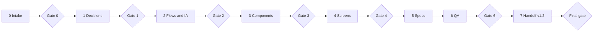

# Nano Beauty App — Phase 9 Gap Closure Brief

Sep 25, 2026 · @Dragon

Phase 9 closes every design gap found in the 25 Sep gap analysis in one waterfall pass — intake, decisions, flows, components, screens, specs, QA and an updated handoff — so the app can go to the Claude-coding team as version 1.2 of the design.

## How to use this brief

This brief is written for the Claude chat that designed the app (Phases 0–7). Run it as one phase with seven stages, in order. Each stage ends at a gate the product owner approves before the next one starts.

**Authority, highest first**

1. The product owner's direct answers during this phase
2. This brief
3. The earlier decisions D01–D32 and the Phase 2, 3 and 7 docs, unless this brief changes them
4. Requirements v1.1 (IDs are the traceability keys)
5. The 25 Sep gap analysis (evidence)

**Sources to open first**

| Source | Link |
| --- | --- |
| Gap analysis (why each item exists) | [Gap Analysis before Benchmarking](https://claude.ai/code/artifact/56806b26-3cbb-4ad2-8898-d97a542c0cf2) |
| Phase 0 register | [Phase Plan & Phase 0 Register](https://claude.ai/artifact/8sdRyvZZAAmdEXFQo7oDtm) |
| Phase 2 navigation | [Phase 2 Navigation (IA)](https://claude.ai/artifact/XrCCYiKDgWordUeq8PV2fv) |
| Phase 3 flows | [Phase 3 Flows](https://claude.ai/artifact/TzGKMiW7TRMApz3oUQrNTJ) |
| Phase 7 handoff | [Phase 7 Developer Handoff](https://claude.ai/artifact/SCMA9ApxvkoEU34bVVbNxw) |
| Design canvas | [Nano Beauty App Screens](https://claude.ai/artifact/5NA9BUxqPEpyu4AjJVLt8C) |
| Design system | [Nano Beauty](https://claude.ai/artifact/3uT3fESwWqALaQK6UjS3Uj) |

**Working rules**

- Update the existing docs, canvas and design system in place. Don't start new copies. Log every change as a change request (CR-01 onward) in the Phase 0 register.
- Keep existing screen IDs. New screens continue each area's numbering (STF-15 onward, BKG-10 onward, and so on). Web pages use WEB-, notification templates use NTF-.
- Nothing already approved is reopened: the visual direction, logo rules, tabs (Option B), fonts, icon and motion stay.
- Every screen gets light and dark, its listed states in Tweaks, and a working Play link from its entry point.
- Anything that waits on the client (Fresha, payment provider, real rules, scope) is designed on a stated assumption and carries a Sample badge, as in Phases 3–6.
- Staff screens use the StaffBar band and existing staff components before any new component is made.

## Scope

This phase covers design work only: the design system, flows, screens and the specs a designer owns. In total: 34 new app screens, 4 web pages, 24 revised screens and 18 components. Anything that needs the client, finance, legal or engineering is listed as a dependency and designed around, not solved.

**In this phase**

- Staff workspace completed: packages, gift cards, promo codes, professionals, appointments and requests, counter redemption, customers and account match, support inbox, clinic settings and booking rules, policies, Home layout, push messages, media, reports, team, archive and delete
- Staff roles simplified for a 2–5 person clinic, with optional two-person approval
- Booking designed in two first-class modes: in-app (if an API exists) and Fresha hand-off (likely)
- Customer fixes: multi-area and multi-service booking, Apple Pay and Google Pay, treatment FAQ and financing line, gift designs, help hub additions, membership hidden by default, consultation price
- Web pages the app depends on: gift claim page, account-deletion request page
- Specs: settings model, delete/archive rules, notification templates, analytics event map, real public prices in fixtures
- Updated Phase 0, 2, 3 and 7 docs, routes.json and fixtures.json

**Not in this phase**

- Benchmarking. It runs next as its own step. Leave one revision slot after it.
- Features the client may still want back: product shop, rewards, referrals, check-in, group booking. No screens until the client confirms scope.
- New membership enrolment (backlog, as agreed)
- Usability testing (postponed under D31; the plan is ready)
- Any code, backend or API design

**Dependencies handed to others** (design proceeds on assumptions until answered)

| Dependency | Owner | Design assumption meanwhile |
| --- | --- | --- |
| Fresha: hand-off or a booking system with an API | Client + tech lead | Both modes designed; hand-off is the default in fixtures |
| Lead360 data export (customers, balances, packages, gift cards, memberships) | Client + tech lead | Import-review and match screens use sample data |
| Payment provider; Klarna/Affirm merchant accounts; Interac through wallets | Client finance + tech lead | Rows show "\[payment provider\]"; availability is a setting |
| Real rules: deposit, cancellation, no-show, hold, gift values, package validity | Client | A1–A8 become admin settings with sample values |
| Scope confirmation: shop, rewards, referrals, check-in | Client | Left out |
| Privacy policy, terms, cancellation policy text | Client / legal | Policy screens show "clinic to write" |
| Backend, CMS, OTP, push and analytics vendors | Tech lead | Specs are vendor-neutral |
| Apple and Google developer accounts; store name check | Client | Not needed for design |
| Correct phone, hours, team list, photo and name consent | Client | Placeholders stay badged |

## Decisions this phase proposes

Eight design decisions shape everything after Stage 1. Record them as D33–D40 in the Phase 0 register. The owner approves them at Gate 1; nothing in Stages 2–7 starts before that.

| ID | Proposed decision | Replaces or extends | Why |
| --- | --- | --- | --- |
| D33 | **Two booking modes.** Mode H (Fresha hand-off) and Mode A (in-app, API). Both are first-class flows chosen by one server setting. Mode H is the default in fixtures. | A1, BKG-08/09 as fallback | Fresha publishes no booking API; hand-off is the likely launch mode |
| D34 | **Three staff roles:** Owner (everything, including publish and finance), Editor (draft and submit content), Front desk (appointments, redemption, customers, support inbox, value lookup). A person can hold more than one. | D25 (five roles) | 2–5 staff; five roles and a second approver can deadlock publishing |
| D35 | **Approval is a setting.** Default: the Owner publishes directly after a confirm step; Editors submit to the Owner. Optional: "Require a second approver for price, policy and offer terms". | ADMIN 08 flow in Flow 9 | Keeps ADMIN 08 possible without blocking a small team |
| D36 | **Archive, don't delete.** Drafts can be deleted. Anything a customer booked, bought, received or saw is archived (hidden from customers, kept for records) and can be restored. Every archive and delete asks for confirmation and writes an audit entry. | Flow 9 lifecycle | No delete existed; deletion would break bookings, packages and receipts |
| D37 | **Rules become settings.** A1–A8 (deposit, windows, hold time, gift values, support hours) and payment-method switches move to staff settings screens. Customer screens read them; nothing is hard-coded. | A1–A8 as fixed samples | The rules are invented until the client confirms them |
| D38 | **Membership hidden by default.** The Wallet row and WAL-05 show only for a customer with an active legacy membership. No other membership surface. | WAL-01 row, WAL-05 | The client asked for no membership in the app now |
| D39 | **Staff screens stay phone-first with a tablet layout.** Staff screens also get a two-column iPad/tablet layout for long forms. No separate web admin. | D11 extended | Entering 30+ services on a phone is slow; D11 keeps admin in the app |
| D40 | **One-time catalogue import.** Staff can review an imported service list (from the Fresha export) and publish it, instead of typing every service. | STF-02/03 manual entry | Saves days of manual entry at launch |

## Stages and gates

The phase runs in seven stages, each closed by a gate the product owner approves. A stage can start only after the previous gate passes; rework after a gate goes through a change request.

Stage 5 specs are written alongside Stage 4 screens where they depend on each other; both are checked together at Stage 6.

| Stage | Work | Deliverables | Exit criteria (gate) |
| --- | --- | --- | --- |
| 0 Intake | Read every source above. Freeze the current canvas as baseline v1.1. Open the change register. | Baseline note in the Phase 0 register; CR list seeded from the traceability table | Owner confirms the baseline and that every gap G01–G41 has a CR |
| 1 Decisions | Present D33–D40 with any alternatives and their impact on screens | D33–D40 in the register with status | Owner approves or edits each decision |
| 2 Flows and IA | Update the staff workspace map and route map. Add and revise flows (Stage 2 table). | Phase 2 doc v2 (staff map, roles, routes); Phase 3 doc v2 (flows 3H, 3, 4, 6, 8, 9 v2 and 10–17) | Every new screen appears in a flow; every flow ends in a success, failure and recovery state |
| 3 Components | Add and extend components (Stage 3 table) with variants, states, tokens and READMEs | Design system update; component list in the handoff | Each component shows all states in light and dark and passes contrast |
| 4 Screens | Revise and add screens (Stage 4 tables) on the canvas | Canvas v1.2 with every listed screen and state | Every screen ID in the tables exists, with states in Tweaks, light and dark, linked in Play |
| 5 Specs | Settings model, delete rules, notification templates, analytics events, content fixes (Stage 5) | Spec sections in the Phase 7 doc; NTF boards; updated fixtures | Each spec is referenced by the screens that use it |
| 6 QA | Fit, accessibility, links, data consistency, traceability (Stage 6) | QA results in the Phase 0 register | Zero open fit, contrast or broken-link issues; every G-row traced |
| 7 Handoff | Update the developer handoff pack (Stage 7) | Phase 7 doc v1.2, routes.json, fixtures.json, changelog | Owner signs the final gate; the pack is ready for the coding team |

## Stage 2: flows to add or change

Five existing flows are revised and nine are added. Draw each one in the Phase 3 style: screens as rectangles, system checks as rounded boxes, and every error named on its arrow.

| Flow | New or revised | Journey | Screens | Requirement IDs |
| --- | --- | --- | --- | --- |
| 3H Booking, hand-off mode | New | Pick treatment(s) in the app → "Booking continues with Fresha" → Fresha in an in-app browser → back → "Checking your booking" → confirmed, not visible yet, or couldn't confirm (call the clinic). Also covers how Home and Visits look when the app can or can't read appointments. | BKG-08, BKG-09 v2, BKG-12, HOM-02/03 v2, VIS-01/02 v2 | BOOK 01–12 (D33) |
| 3 Booking, in-app mode | Revised | Adds a multi-service step and an area picker (laser) with a running total, before professional and time | BKG-01 v2, BKG-10, BKG-11 | BOOK 01–06, DISC 07 |
| 4 Pay | Revised | Adds Apple Pay and Google Pay (Interac through wallets); method list comes from settings | PAY-01 v2 | PAY 01–05, 12 |
| 6 Wallet | Revised | Gift purchase gains a design step; membership shows only for legacy members; package and gift redemption at the counter appears in history | WAL-01 v2, WAL-05 v2, WAL-13 | WALT 01–08, MEM 02 |
| 8 Support and account | Revised | Help hub gains directions and parking; new "Not sure? Ask us" request goes to the staff inbox; replies land in the customer inbox | SUP-01 v2, SUP-04, SUP-05, ACC-04 | SUP 01–04, NOTIF 05 |
| 9 Staff lifecycle | Revised | Adds Archived (restorable) and Delete draft; Owner self-publish with confirm; optional second approver (D35, D36) | STF-03, 06, 08, 09 v2, STF-39 | ADMIN 03, 06, 08, 10 |
| 10 Counter redemption | New | Front desk finds the client (phone search or the QR on the client's visit or wallet) → picks a package session or gift-card amount → confirms → ledger updates → client gets a receipt | STF-25, WAL-06 | WALT 04, 07, 08 |
| 11 Gift recipient | New | Scheduled send → text or email (NTF) → has the app: claim in app (WAL-11) → no app: web claim page → verify phone or keep the code for the clinic → claimed | NTF-07, WEB-01, WEB-02, WAL-11 | WALT 02–04 |
| 12 Appointment requests | New | Late change, cancel request or "awaiting clinic" visit → staff queue → approve, decline or call → client notified | STF-23, STF-24, VIS-02 | BOOK 08–10, SUP 02 |
| 13 Account match check | New | Customer mismatch (AUT-06) → case in the staff queue → compare old-app and new records → confirm, reject or ask the client → value moves only after confirmation | STF-26, 27, 28, AUT-06 | AUTH 11, LEG 04, ADMIN 09 |
| 14 Support inbox | New | Contact form, balance help or "Ask us" → inbox → reply by text, email or in-app message → closed | STF-29, STF-30, WAL-12, SUP-03 | SUP 03–04, ADMIN 09 |
| 15 Content admin pattern | New | One pattern for packages, gift settings, promo codes, professionals, policies, Home layout, push and media: list → sectioned edit → preview → save or publish (D35) → archive (D36) | STF-15–22, 33–36 | ADMIN 02–05, PROMO 01–07 |
| 16 Catalogue import | New | Choose an export file → match columns → review new, changed and duplicate services → fix → publish the selected ones | STF-41, STF-42 | ADMIN 02, DISC 02, 09 (D40) |
| 17 Settings change | New | Edit a rule → see what it affects ("applies to new bookings only") → confirm → audit entry | STF-31, STF-32 | ADMIN 06, PAY 05, 12 (D37) |

Also update the Phase 2 staff workspace map: Owner / Editor / Front desk columns (D34) and the new areas (Today, Selling, People, Settings, Reports).

## Stage 3: design system additions

Fourteen new components and four extensions, built in the existing Nano Beauty system: same tokens, a README each, all states in light and dark. No new colours or type styles unless a component can't be built without one; if so, add it as a semantic token and note why.

| Component | New or extend | Used by | States and variants to show |
| --- | --- | --- | --- |
| FormSection | New | STF-03, 06, 16, 18, 20, 22, 31–35 | Collapsed, expanded, has error, complete; tablet two-column |
| ImagePicker / MediaTile | New | STF-03, 06, 16, 22, 36 | Empty, uploading, uploaded, too small, rights missing, alt text missing |
| DateTimeRange | New | STF-06, 20, 31, 35 | Start/end, timezone shown (PT), end before start, overlaps closure |
| SettingRow | New | STF-31, 32, ACC-03 | Toggle, value, stepper, locked by role, changed-not-saved |
| ReorderList | New | STF-04, 15, 34 | Resting, dragging, drop target; accessible Move up / Move down buttons |
| ConfirmDialog (archive / delete) | Extend Dialog | All staff lists (D36) | Archive, delete draft, restore; lists what is affected; destructive button |
| SimpleTextEditor | New | STF-33, 40, 30 | Bold, list, link only; character count; error |
| StatTile + mini bar | New | STF-01 v2, STF-37 | Value, change vs last period, empty, loading |
| AreaPicker | New | BKG-10, TRT-05 | Multi-select areas, running total, max reached, men's/women's area sets |
| ServiceBasket | New | BKG-11, BKG-05 | 1 to N services, total duration and price, remove, over-length warning |
| GiftDesignPicker | New | WAL-13 | Occasion designs, selected, image loading |
| WalletPayButton | New | PAY-01 v2 | Apple Pay, Google Pay (follow each brand's button rules), unavailable |
| RatingSummary | New | TRT-05, HOM-01 | Rating + count + source, no rating yet; flagged off by default |
| FAQBlock | New | TRT-05, SUP-01 | Collapsed, expanded, long answer |
| QueueItem | New | STF-23, 28, 29 | New, in progress, waiting on client, done; time since |
| RoleBadge / role model | Extend Badge | STF-13, 38, StaffBar | Owner, Editor, Front desk (D34) |
| PublishState | Extend | All staff lists | Adds Archived and Deleted (draft) |
| StaffBar | Extend | All staff screens | Tablet layout; environment tag unchanged |

## Stage 4: customer and web screens

Fourteen customer screens change, six are added, and four simple mobile-web pages are added. Where a screen differs by booking mode, add a Tweaks switch `mode: handoff | inapp` (D33).

**Revised customer screens**

| Screen | Change | New states |
| --- | --- | --- |
| HOM-01 Guest home | Optional rating line under the hero (RatingSummary, off by default) | rating on / off |
| HOM-02 Home with visit | Visit card in hand-off mode: synced visit, or "Your bookings are in Fresha" with an Open button | mode, synced / not synced |
| HOM-03 Home, no visit | "Book again" opens Fresha in hand-off mode | mode |
| TRT-05 Treatment detail | FAQ block; "Financing available" line (setting-driven); area picker entry for per-area services; consultation copy "$20, credited to your treatment" (Sample) | faq, financing on/off, perarea |
| BKG-01 Service | Multi-select with ServiceBasket; consultation price fixed | one, several |
| BKG-05 Review | Shows the basket (several services, total time and price) | basket |
| BKG-08 Fresha hand-off | Promoted to main path: what carries over, what to expect, in-app browser | mode handoff default |
| BKG-09 Fresha return | Adds "Booked, but not showing yet" with a refresh time | checking, confirmed, notyet, notvisible |
| VIS-01 Visits | Hand-off mode: synced list, or explanation + Open Fresha | mode, synced / not synced |
| VIS-02 Visit detail | Hand-off mode: changes happen in Fresha; late-change request still goes to the clinic | mode |
| PAY-01 Method | Apple Pay and Google Pay rows first; methods shown come from settings | wallets on/off |
| WAL-01 Wallet | Membership row only for legacy members (D38) | member / not member |
| WAL-05 Member status | Legacy-only screen, no enrolment path | — |
| SUP-01 Help hub | Directions (opens maps), parking, "Not sure which treatment? Ask us" | — |

**New customer screens**

| ID | Screen | States |
| --- | --- | --- |
| BKG-10 | Choose areas (laser and per-area services), running total | none picked, some, max reached, men's / women's set |
| BKG-11 | Your visit basket: add another treatment, remove, total time | 1 item, several, too long for one visit |
| BKG-12 | "How booking works" one-time explainer for hand-off mode | first time, don't show again |
| WAL-13 | Choose a gift design (occasion cards) before the value step | loading, selected |
| SUP-04 | Ask us: treatment question form (concern, preferred contact, message) | empty, error, sending |
| SUP-05 | Request sent, with reference and reply time | — |

**New mobile-web pages** (hosted outside the app; no website redesign)

| ID | Page | Why |
| --- | --- | --- |
| WEB-01 | Gift claim: the recipient sees the card and message, then verifies a phone or keeps the code | Recipients without the app (Flow 11) |
| WEB-02 | Gift claimed / get the app | End of Flow 11 |
| WEB-03 | Account deletion request (phone + code) | Google Play requires a web deletion route |
| WEB-04 | Deletion request received, with what happens next | End of WEB-03 |

## Stage 4: staff screens

Ten staff screens change and 28 are added (STF-15 to STF-42). Every list gets search, filter by status, and Archive in its row menu (D36). Every edit screen gets Save draft, Publish or Submit (by role, D35), Preview where customers see the result, and the conflict, offline and save-failed states from STF-03. Draw long forms at phone width and show one tablet layout per form (D39).

**Revised staff screens**

| Screen | Change |
| --- | --- |
| STF-01 Staff home | Sections: Today (appointments, requests, inbox counts), Content, Selling, People, Settings, Reports. What shows depends on role. |
| STF-02 Services | Row menu: Edit, Archive, Restore; Archived filter; "Import list" entry (STF-41) |
| STF-03 Service edit | Full sectioned form: details, category and concerns, description, preparation and aftercare, price and duration, professionals, deposit rule, photos and alt text, visibility, FAQ |
| STF-04 Categories and concerns | Rename, move a treatment between categories, archive an empty category |
| STF-05 Campaigns | Pause, End now, Duplicate ("reuse last year's Halloween"), calendar view by month |
| STF-06 Campaign edit | Image, body text, discount type and value, promo code link, audience, eligible items, Home placement, push toggle, event template picker (Halloween, Canada Day, Black Friday, holidays, own offer) |
| STF-08 Approvals | Only when a second approver is on (D35); otherwise a "Recently published" log |
| STF-09 Approval detail | Owner self-publish confirm variant |
| STF-11 Value lookup | Search by phone as well as reference; gift-card actions link to STF-18 |
| STF-13 Team and roles | Owner / Editor / Front desk; opens STF-38 |

**New staff screens**

| ID | Screen | Key states | Req IDs |
| --- | --- | --- | --- |
| STF-15 | Packages list | live, draft, archived, empty | ADMIN 04 |
| STF-16 | Package edit: treatment, sessions, price, regular value and saving, validity, terms, photo | draft, invalid, live | ADMIN 04, WALT 05 |
| STF-17 | Gift-card settings: preset amounts, custom range, designs, terms (no expiry, BC) | saved, invalid range | ADMIN 04, WALT 01 |
| STF-18 | Gift-card actions: resend, change recipient, void, reissue | found, sent, voided | ADMIN 09, WALT 03 |
| STF-19 | Promo codes list | active, scheduled, used up, archived | PROMO 06 |
| STF-20 | Promo code edit: code, discount, eligible items, limits per person and total, dates | duplicate code, invalid | PROMO 03, 06 |
| STF-21 | Professionals list | active, hidden | DISC 06 |
| STF-22 | Professional edit: name, title, bio, photo, services performed, visible or not | consent missing, live | DISC 06, ADMIN 02 |
| STF-23 | Today and requests queue | appointments today, open requests, empty, hand-off mode (requests only) | BOOK 08–10 |
| STF-24 | Request detail: approve, decline with reason, call the client | pending, done | BOOK 09–10 |
| STF-25 | Counter redemption: find client, use a package session or gift amount, confirm | found, not enough balance, done | WALT 04, 07 |
| STF-26 | Customer search (name, phone) | results, none | ADMIN 09 |
| STF-27 | Customer profile: visits, value, messages, account status; no clinical notes | full, legacy match pending | ADMIN 09, PRIV 07 |
| STF-28 | Account match check: old app vs new record, confirm or reject | match, partial, reject | AUTH 11, LEG 04 |
| STF-29 | Support inbox | new, in progress, waiting on client, done, empty | SUP 03–04 |
| STF-30 | Message detail and reply (text, email or in-app) | draft reply, sent, failed | SUP 03 |
| STF-31 | Clinic info: address, phone, hours, holiday closures | saved, closure overlaps bookings | SUP 01 |
| STF-32 | Booking and payment rules: deposit, windows, hold, no-show, payment methods on/off, booking mode | saved, change affects new bookings only | PAY 05, 12 (D33, D37) |
| STF-33 | Policies: cancellation, deposit, refund, terms, privacy (list + editor, versioned) | draft, live, version history | AUTH 10, PRIV 01 |
| STF-34 | Home layout: which offers show (max two) and their order | set, empty | DISC 11, PROMO 05 |
| STF-35 | Push message composer: audience (opted-in only), text, link, schedule, preview | draft, scheduled, sent, no audience | PROMO 07, NOTIF 04 |
| STF-36 | Media library and picker: upload, alt text, rights confirmed | empty, uploading, rights missing | ADMIN 02 |
| STF-37 | Reports: bookings started and completed, campaign results, gift and package sales | this month, empty, loading | PROMO 08 |
| STF-38 | Team member: roles, invite resend, remove access | active, invited, removed | ADMIN 01 |
| STF-39 | Archive and delete confirm (dialog board for every list) | archive, delete draft, restore | ADMIN 06 (D36) |
| STF-40 | FAQ editor | draft, live | ADMIN 05 |
| STF-41 | Import: choose file and match columns | mapped, missing column | ADMIN 02 (D40) |
| STF-42 | Import: review new, changed and duplicate services, then publish | review, conflicts, published | ADMIN 02, DISC 09 |

## Stage 5: specs

Five specs go into the Phase 7 handoff. They stop the coding team from inventing rules, copy or tracking.

**1. Settings model (D37)**

| Setting | Type | Sample value | Edited on | Read by |
| --- | --- | --- | --- | --- |
| Booking mode | handoff / inapp | handoff | STF-32 | BKG, VIS, HOM |
| Deposit rule | amount + threshold, or none | $50 over $150 | STF-32 | BKG-05, PAY-01 |
| Free change window | hours | 48 | STF-32 | VIS-02–06 |
| Late cancel and no-show outcome | keep deposit / credit / none | credit | STF-32 | VIS-04, policies |
| Slot hold | minutes | 10 | STF-32 | BKG-03–05 |
| Payment methods | on/off each: card, Apple Pay, Google Pay, Klarna, Affirm | card on, others off | STF-32 | PAY-01, TRT-05 |
| Financing line on treatments | on/off + minimum amount | off | STF-32 | TRT-05 |
| Gift amounts | presets + custom min/max; expiry locked off (BC) | $50/$100/$150/$200; $25–$500 | STF-17 | WAL-08 |
| Consultation price | amount + credited yes/no | $20, credited | STF-03 | TRT-05, BKG-01 |
| Second approver | on/off + which fields | off | STF-32 | Flow 9 |
| Clinic hours and closures | weekly + dates | \[clinic to confirm\] | STF-31 | SUP-01, SUP-03 |
| Rating line | on/off + source | off | STF-34 | HOM-01, TRT-05 |

**2. Archive and delete rules (D36)**

| Item | Delete | Archive | What customers see after archive |
| --- | --- | --- | --- |
| Draft (any type) | Yes | — | Nothing (never live) |
| Service | No | Yes | Hidden from lists; open visits keep it; old links show TRT-07 archived |
| Package | No | Yes | No longer sold; owned packages stay usable to expiry |
| Campaign / promo code | No | Yes (or End now) | Offer ended page (OFR-04) |
| Professional | No | Yes | Hidden; booked visits keep the name |
| Category | Only if empty | Yes | Treatments must move first |
| FAQ, policy version, media | Draft only | Yes | Older policy versions stay in history |
| Staff member | No | Remove access | — (audit keeps their actions) |

**3. Notification templates (NTF boards)**: NTF-01 booking confirmed, NTF-02 reminder, NTF-03 changed, NTF-04 cancelled with refund or credit, NTF-05 payment receipt, NTF-06 refund status, NTF-07 gift received (text and email with WEB-01 link), NTF-08 gift scheduled/sent to buyer, NTF-09 package session used, NTF-10 support reply, NTF-11 staff: request needs you, NTF-12 staff: approval needed. For each: channel (push, text, email), trigger, copy, deep link, and whether it's transactional or needs marketing consent.

**4. Analytics event map**: one row per event: screen ID, event name, properties, consent needed. Minimum: treatment viewed, booking started, each booking step, hand-off opened and returned, payment started / succeeded / failed by method, offer viewed and tapped, promo code result, gift and package purchased, support contact, account deleted. Tie each event to the success measures in requirements v1.1.

**5. Content fixes in fixtures and boards**

- Use real public prices where known: laser from $50 per area, HIFU lower face $250, SQT $350 or 4 for $1,200, consultation $20 credited. Keep the Sample badge until the clinic confirms.
- Add the missing Fresha services to the draft catalogue: filler, fat dissolving, Liposonix, PRF, skin brightening, intimate brightening, Chrome nail fungus, Photo Frax, Plasma Frax, face massage, PMU.
- Remove the membership fixture from default customer data (D38).
- Phone, hours and team stay as bracketed placeholders until the clinic confirms.

## Stages 6–7: QA and handoff update

Stage 6 repeats the Phase 6 QA on the new and revised work. Stage 7 turns the result into handoff pack v1.2 for the coding team.

**Stage 6 QA checklist**

- [ ] Fit: every new and revised screen and every state, light and dark, phone and (for staff forms) tablet. No clipped or overflowing text.
- [ ] Accessibility: contrast, button and link names, form labels, image alt text, 44 pt / 48 dp targets, Move up / Move down alternatives to dragging
- [ ] Links: every new screen is reachable in Play from its entry point; no dead links
- [ ] Data: sample values agree across screens (prices, balances, names, dates); settings values match the Stage 5 table
- [ ] Mode check: every booking-related screen has both modes where the table says so
- [ ] Role check: every staff screen is shown for the right roles (D34); an Editor never sees Publish when a second approver is off
- [ ] Truth-first: no booking, payment, redemption, claim or balance shows success before the system answers
- [ ] Traceability: every G-row in the next section points to a finished screen, flow, component or spec

**Stage 7 handoff updates**

| Item | Update |
| --- | --- |
| Phase 7 doc | v1.2: new routes, state contracts for new screens, roles table v2 (D34), settings model, archive rules, NTF templates, analytics map, D33 booking-mode notes |
| routes.json | Add all new routes with screen ID, sign-in or role, and booking-mode flag |
| fixtures.json | Real public prices, new staff data (packages, codes, requests, inbox, customers), membership only on a legacy-member fixture |
| Design system | New components with READMEs; component list in the handoff |
| Phase 0 register | D33–D40, CR list closed with dates, QA results, open dependencies |
| Phase 2 and 3 docs | v2 staff map and flows 3H, 9 v2, 10–17 |
| Changelog | One table: v1.1 → v1.2, per screen ID, what changed and why (G-ID) |
| Starter note | Remind the coding team that D20 (starter update) must be done first, and list what changed for NANO-02/15/16 |

## Traceability

The 41 gaps below come from the gap analysis. 39 are closed by design work in this phase. G03 and G28 wait on the client, and G02 and G14 also need outside input (the data export, the policy text). Seed the CR list from this table at Stage 0.

| G | Gap | Closed by |
| --- | --- | --- |
| G01 | Fresha has no booking API | D33, Flow 3H, BKG-08, 09, 12, HOM-02/03, VIS-01/02, STF-32 |
| G02 | Old-app (Lead360) data and matching | STF-27, STF-28, Flow 13; export itself is a Dependency |
| G03 | Shop, rewards, referrals, check-in scope | Dependency: client confirms scope |
| G04 | No package admin | STF-15, STF-16 |
| G05 | No gift-card settings | STF-17 |
| G06 | No gift-card actions | STF-18 |
| G07 | No promo-code admin | STF-19, STF-20 |
| G08 | No professionals admin | STF-21, STF-22 |
| G09 | No appointment or request handling | Flow 12, STF-23, STF-24 |
| G10 | No customer search or match check | Flow 13, STF-26–28 |
| G11 | Refunds and balance fixes only proposed | STF-11 v2, STF-18, Flow 9 v2 |
| G12 | No push or inbox messages from staff | STF-35, NTF-10 |
| G13 | No control of offers on Home | STF-34 |
| G14 | No policy editing | STF-33 (text itself: Dependency on client/legal) |
| G15 | Clinic info and hours only partly editable | STF-31 |
| G16 | Rules A1–A8 hard-coded | D37, STF-32, spec 1 |
| G17 | No media library | STF-36, ImagePicker |
| G18 | Customer messages have no staff inbox | Flow 14, STF-29, STF-30 |
| G19 | No reports | STF-37, StatTile |
| G20 | No delete or archive | D36, STF-39, PublishState, spec 2 |
| G21 | Approval can deadlock | D34, D35, STF-08/09 v2 |
| G22 | Can't change roles or remove staff | STF-13 v2, STF-38 |
| G23 | Service edit shows 5 of 13 fields | STF-03 v2, FormSection |
| G24 | Campaign editor incomplete; no event templates | STF-05, STF-06 v2 |
| G25 | Categories can't be renamed or moved | STF-04 v2 |
| G26 | No counter redemption | Flow 10, STF-25 |
| G27 | One service per booking; no area picker | Flow 3 v2, BKG-01, 05, 10, 11, AreaPicker, ServiceBasket |
| G28 | Group booking | Dependency: client confirms need |
| G29 | No treatment FAQ or financing line | TRT-05 v2, FAQBlock, spec 1 |
| G30 | No reviews or rating | RatingSummary, off by default until the client decides |
| G31 | Consultation shown free; Fresha says $20 credited | TRT-05, BKG-01, spec 1 and 5 |
| G32 | No gift-card designs | WAL-13, GiftDesignPicker, STF-17 |
| G33 | Gift recipients without the app | Flow 11, NTF-07, WEB-01, WEB-02 |
| G34 | No Apple Pay or Google Pay | PAY-01 v2, WalletPayButton, STF-32 |
| G35 | Membership visible against the client's wish | D38, WAL-01, WAL-05 v2 |
| G36 | Help hub lacks directions, parking, questions | SUP-01 v2, SUP-04, SUP-05 |
| G37 | Android web deletion page | WEB-03, WEB-04 |
| G38 | No notification templates (customer and staff) | NTF-01–12 |
| G39 | No analytics event map | Spec 4 |
| G40 | Sample prices wrong; services missing from catalogue | Spec 5 |
| G41 | Entering the catalogue on a phone is slow | D39, D40, STF-41, STF-42 |

## Definition of done and final gate

The phase is done when the owner signs the final gate on this checklist. The pack then goes to the coding team as design v1.2, and benchmarking starts.

- [ ] D33–D40 approved and recorded
- [ ] Flows 3H, 3, 4, 6, 8, 9 v2 and 10–17 in the Phase 3 doc, each with success, failure and recovery
- [ ] 18 components in the design system with all states, light and dark
- [ ] 34 new app screens, 4 web pages and 24 revised screens on the canvas, with listed states, both themes, Play links
- [ ] 12 NTF template boards
- [ ] Settings model, archive rules, analytics map and content fixes in the Phase 7 doc
- [ ] Stage 6 QA: zero open fit, contrast or link issues
- [ ] Every G-row traced to finished work or marked Dependency with its owner
- [ ] Handoff v1.2, routes.json, fixtures.json and changelog published
- [ ] Open dependencies listed with owners in the Phase 0 register

After the gate: run the benchmark, then one revision pass (CRs only) before coding starts on affected routes.
